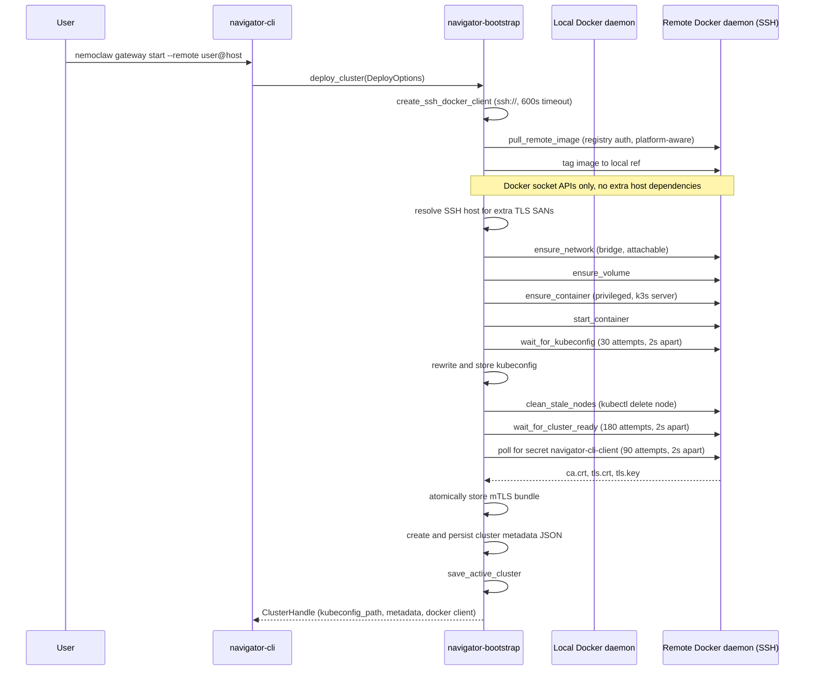
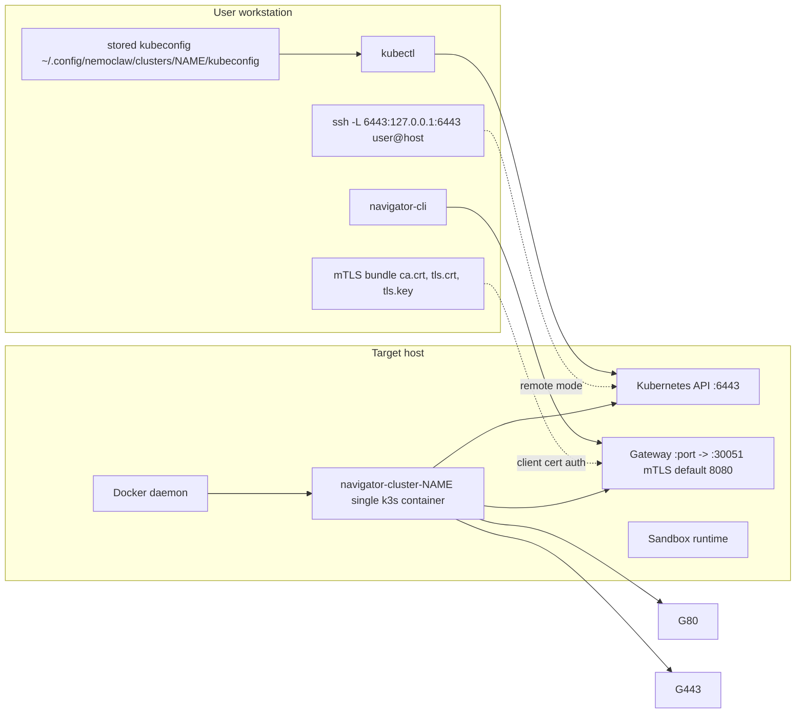
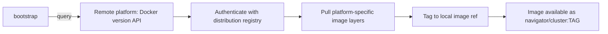

# Cluster Bootstrap Architecture

This document describes how NemoClaw bootstraps a single-node k3s cluster inside a Docker container, for both local and remote (SSH) targets.

## Goals and Scope

- Provide a single bootstrap flow through `navigator-bootstrap` for local and remote cluster lifecycle.
- Keep Docker as the only runtime dependency for provisioning and lifecycle operations.
- Package the NemoClaw cluster as one container image, transferred to the target host via registry pull.
- Support idempotent `deploy` behavior (safe to re-run).
- Persist cluster access artifacts (kubeconfig, metadata, mTLS certs) in the local XDG config directory.
- Track the active cluster so most CLI commands resolve their target automatically.

Out of scope:

- Multi-node orchestration.

## Components

- `crates/navigator-cli/src/main.rs`: CLI entry point; `clap`-based command parsing.
- `crates/navigator-cli/src/run.rs`: CLI command implementations (`gateway_start`, `gateway_stop`, `gateway_destroy`, `gateway_info`, `gateway_tunnel`).
- `crates/navigator-cli/src/bootstrap.rs`: Auto-bootstrap helpers for `sandbox create` (offers to deploy a cluster when one is unreachable).
- `crates/navigator-bootstrap/src/lib.rs`: Cluster lifecycle orchestration (`deploy_cluster`, `deploy_cluster_with_logs`, `cluster_handle`, `check_existing_deployment`).
- `crates/navigator-bootstrap/src/docker.rs`: Docker API wrappers (network, volume, container, image operations).
- `crates/navigator-bootstrap/src/image.rs`: Remote image registry pull with XOR-obfuscated distribution credentials.
- `crates/navigator-bootstrap/src/runtime.rs`: In-container operations via `docker exec` (kubeconfig readiness, health polling, stale node cleanup, deployment restart).
- `crates/navigator-bootstrap/src/kubeconfig.rs`: Kubeconfig rewriting, storage, and merge into local `~/.kube/config`.
- `crates/navigator-bootstrap/src/metadata.rs`: Cluster metadata creation, storage, and active cluster tracking.
- `crates/navigator-bootstrap/src/mtls.rs`: Gateway TLS detection and CLI mTLS bundle extraction.
- `crates/navigator-bootstrap/src/push.rs`: Local development image push into k3s containerd.
- `crates/navigator-bootstrap/src/paths.rs`: XDG path resolution.
- `crates/navigator-bootstrap/src/constants.rs`: Shared constants (image name, network name, container/volume naming).
- `deploy/docker/Dockerfile.cluster`: Container image definition (k3s base + Helm charts + manifests + entrypoint).
- `deploy/docker/cluster-entrypoint.sh`: Container entrypoint (DNS proxy, registry config, manifest injection).
- `deploy/docker/cluster-healthcheck.sh`: Docker HEALTHCHECK script.
- Docker daemon(s):
  - Local daemon for local deploys.
  - Remote daemon over SSH for remote deploy container operations.

## CLI Commands

All cluster lifecycle commands live under `nemoclaw gateway`:

| Command | Description |
|---|---|
| `nemoclaw gateway start [--name NAME] [--remote user@host] [--ssh-key PATH]` | Provision or update a cluster |
| `nemoclaw gateway stop [--name NAME] [--remote user@host]` | Stop the container (preserves state) |
| `nemoclaw gateway destroy [--name NAME] [--remote user@host]` | Destroy container, attached volumes, kubeconfig directory, metadata, and network |
| `nemoclaw gateway info [--name NAME]` | Show deployment details (endpoint, kubeconfig path, SSH host) |
| `nemoclaw gateway tunnel [--name NAME] [--remote user@host] [--print-command]` | Start or print SSH tunnel for kubectl access |
| `nemoclaw status` | Show gateway health via gRPC/HTTP |
| `nemoclaw gateway select <name>` | Set the active cluster |
| `nemoclaw gateway select` | List all clusters with metadata |

The `--name` flag defaults to `"nemoclaw"`. When omitted on commands that accept it, the CLI resolves the active cluster via: `--gateway` flag, then `NEMOCLAW_CLUSTER` env, then `~/.config/nemoclaw/active_cluster` file.

## Local Task Flows (`mise`)

Development task entrypoints split bootstrap behavior:

| Task | Behavior |
|---|---|
| `mise run cluster` | Bootstrap or incremental deploy: creates cluster if needed (fast recreate), then detects changed files and rebuilds/pushes only impacted components |
| `mise run cluster:build:full` | Full build path: builds cluster/server/sandbox images, pushes components, then deploys (preferred in CI) |

For `mise run cluster`, `.env` acts as local source-of-truth for `CLUSTER_NAME`, `GATEWAY_PORT`, and `NEMOCLAW_CLUSTER`. Missing keys are appended; existing values are preserved. If `GATEWAY_PORT` is missing, the task selects a free local port and persists it.
Fast mode ensures a local registry (`127.0.0.1:5000`) is running and configures k3s to mirror pulls via `host.docker.internal:5000`, so the cluster task can push/pull local component images consistently.

## Bootstrap Sequence Diagram



## End-State Connectivity Diagram



## Deploy Flow

### 1) Entry and client selection

`deploy_cluster(DeployOptions)` in `crates/navigator-bootstrap/src/lib.rs` chooses execution mode:

- `DeployOptions` fields: `name: String`, `image_ref: Option<String>`, `remote: Option<RemoteOptions>`, `port: u16` (default 8080).
- `RemoteOptions` fields: `destination: String`, `ssh_key: Option<String>`.
- **Local deploy**: Create one Docker client with `Docker::connect_with_local_defaults()`.
- **Remote deploy**: Create SSH Docker client via `Docker::connect_with_ssh()` with a 600-second timeout (for large image transfers). The destination is prefixed with `ssh://` if not already present.

The `deploy_cluster_with_logs` variant accepts an `FnMut(String)` callback for progress reporting. The CLI wraps this in a `ClusterDeployLogPanel` for interactive terminals.

**Pre-deploy check** (CLI layer in `gateway_start`): In interactive terminals, `check_existing_deployment` inspects whether a container or volume already exists. If found, the user is prompted to destroy and recreate or reuse the existing cluster.

### 2) Image readiness

Image ref resolution in `default_cluster_image_ref()`:

1. If `NEMOCLAW_CLUSTER_IMAGE` is set and non-empty, use it verbatim.
2. Otherwise, use the published distribution image base (`<distribution-registry>/navigator/cluster`) with its default tag behavior.

- **Local deploy**: `ensure_image()` inspects the image on the local daemon and pulls from the configured registry if missing (using built-in distribution credentials when pulling from the default distribution host).
- **Remote deploy**: `pull_remote_image()` queries the remote daemon's architecture via `Docker::version()`, pulls the matching platform variant from the distribution registry (with XOR-decoded credentials), and tags the pulled image to the expected local ref (for example `navigator/cluster:dev` when an explicit local tag is requested).

### 3) Runtime infrastructure

For the target daemon (local or remote):

1. **Ensure bridge network** `navigator-cluster` (attachable, bridge driver) via `ensure_network()`.
2. **Ensure volume** `navigator-cluster-{name}` via `ensure_volume()`.
3. **Compute extra TLS SANs**:
   - For **local deploys**: Check `DOCKER_HOST` for a non-loopback `tcp://` endpoint (e.g., `tcp://docker:2375` in CI). If found, extract the host as an extra SAN. The function `local_gateway_host_from_docker_host()` skips `localhost`, `127.0.0.1`, and `::1`.
   - For **remote deploys**: Extract the host from the SSH destination (handles `user@host`, `ssh://user@host`), resolve via `ssh -G` to get the canonical hostname/IP. Include both the resolved host and original SSH host (if different) as extra SANs.
4. **Ensure container** `navigator-cluster-{name}` via `ensure_container()`:
   - k3s server command: `server --disable=traefik --tls-san=127.0.0.1 --tls-san=localhost --tls-san=host.docker.internal` plus computed extra SANs.
   - Privileged mode.
   - Volume bind mount: `navigator-cluster-{name}:/var/lib/rancher/k3s`.
   - Network: `navigator-cluster`.
   - Extra host: `host.docker.internal:host-gateway`.
   - Port mappings:

     | Container Port | Host Port | Purpose |
     |---|---|---|
     | 6443/tcp | 6443 | Kubernetes API |
     | 30051/tcp | configurable (default 8080) | NemoClaw service NodePort (mTLS) |

   - Container environment variables (see [Container Environment Variables](#container-environment-variables) below).
   - If the container exists with a different image ID (compared by inspecting the content-addressable ID), it is stopped, force-removed, and recreated. If the image matches, the existing container is reused.
5. **Start container** via `start_container()`. Tolerates already-running 409 conflict.

### 4) Readiness and artifact extraction

After the container starts:

1. **Poll kubeconfig**: `wait_for_kubeconfig()` runs `cat /etc/rancher/k3s/k3s.yaml` via `docker exec` up to 30 times, 2 seconds apart (60s total). Each attempt first checks that the container is still running. Validates the output contains `apiVersion:` and `clusters:`.
2. **Rewrite kubeconfig**: Replace the server address with `https://127.0.0.1:6443`. Rename `default` entries (cluster, context, user) to the cluster name. Remote mode appends `-remote` suffix (e.g., `{name}-remote`) to avoid collisions with local contexts.
3. **Store kubeconfig** at `~/.config/nemoclaw/clusters/{name}/kubeconfig` (or `$XDG_CONFIG_HOME/nemoclaw/clusters/{name}/kubeconfig`).
4. **Clean stale nodes**: `clean_stale_nodes()` finds `NotReady` nodes via `kubectl get nodes` and deletes them. This is needed when a container is recreated but reuses the persistent volume -- k3s registers a new node (using the container ID as hostname) while old node entries persist in etcd. Non-fatal on error; returns the count of removed nodes.
5. **Push local images** (optional, local deploy only): If `NEMOCLAW_PUSH_IMAGES` is set, the comma-separated image refs are exported from the local Docker daemon as a single tar, uploaded into the container via `docker put_archive`, and imported into containerd via `ctr images import` in the `k8s.io` namespace. After import, `kubectl rollout restart deployment/navigator -n navigator` is run, followed by `kubectl rollout status --timeout=180s` to wait for completion. See `crates/navigator-bootstrap/src/push.rs`.
6. **Wait for cluster health**: `wait_for_cluster_ready()` polls the Docker HEALTHCHECK status up to 180 times, 2 seconds apart (6 min total). A background task streams container logs during this wait. Failure modes:
   - Container exits during polling: error includes recent log lines.
   - Container has no HEALTHCHECK instruction: fails immediately.
   - HEALTHCHECK reports unhealthy on final attempt: error includes recent logs.

### 5) mTLS bundle capture

TLS is always required. `fetch_and_store_cli_mtls()` polls for Kubernetes secret `navigator-cli-client` in namespace `navigator` (90 attempts, 2 seconds apart, 3 min total). Each attempt checks the container is still running. The secret's base64-encoded `ca.crt`, `tls.crt`, and `tls.key` fields are decoded and stored.

Storage location: `~/.config/nemoclaw/clusters/{name}/mtls/`

Write is atomic: write to `.tmp` directory, validate all three files are non-empty, rename existing directory to `.bak`, rename `.tmp` to final path, then remove `.bak`.

### 6) Metadata persistence

`create_cluster_metadata()` produces a `ClusterMetadata` struct:

- **Local**: endpoint `https://127.0.0.1:{port}` by default, or `https://{docker_host}:{port}` when `DOCKER_HOST` is a non-loopback `tcp://` endpoint. `is_remote=false`.
- **Remote**: endpoint `https://{resolved_host}:{port}`, `is_remote=true`, plus SSH destination and resolved host.

Metadata fields:

| Field | Type | Description |
|---|---|---|
| `name` | `String` | Cluster name |
| `gateway_endpoint` | `String` | HTTPS endpoint with port (e.g., `https://127.0.0.1:8080`) |
| `is_remote` | `bool` | Whether cluster is remote |
| `gateway_port` | `u16` | Host port mapped to the gateway NodePort |
| `remote_host` | `Option<String>` | SSH destination (e.g., `user@host`) |
| `resolved_host` | `Option<String>` | Resolved hostname/IP from `ssh -G` |

Metadata location: `~/.config/nemoclaw/clusters/{name}_metadata.json`

Note: metadata is stored at the `clusters/` level (not nested inside `{name}/` like kubeconfig and mTLS).

After deploy, the CLI calls `save_active_cluster(name)`, writing the cluster name to `~/.config/nemoclaw/active_cluster`. Subsequent commands that don't specify `--gateway` or `NEMOCLAW_CLUSTER` resolve to this active cluster.

## Container Image

The cluster image is defined in `deploy/docker/Dockerfile.cluster`:

```
Base:  rancher/k3s:v1.35.2-k3s1
```

Layers added:

1. Custom entrypoint: `deploy/docker/cluster-entrypoint.sh` -> `/usr/local/bin/cluster-entrypoint.sh`
2. Healthcheck script: `deploy/docker/cluster-healthcheck.sh` -> `/usr/local/bin/cluster-healthcheck.sh`
3. Packaged Helm charts: `deploy/docker/.build/charts/*.tgz` -> `/var/lib/rancher/k3s/server/static/charts/`
4. Kubernetes manifests: `deploy/kube/manifests/*.yaml` -> `/opt/navigator/manifests/`

Bundled manifests include:
- `navigator-helmchart.yaml` (NemoClaw Helm chart auto-deploy)
- `envoy-gateway-helmchart.yaml` (Envoy Gateway for Gateway API)
- `agent-sandbox.yaml`

The HEALTHCHECK is configured as: `--interval=5s --timeout=5s --start-period=20s --retries=60`.

## Entrypoint Script

`deploy/docker/cluster-entrypoint.sh` runs before k3s starts. It performs:

### DNS proxy setup

On Docker custom networks, `/etc/resolv.conf` contains `127.0.0.11` (Docker's internal DNS). k3s detects this loopback and falls back to `8.8.8.8`, which does not work on Docker Desktop. The entrypoint solves this by:

1. Discovering Docker's real DNS listener ports from the `DOCKER_OUTPUT` iptables chain.
2. Getting the container's `eth0` IP as a routable address.
3. Adding DNAT rules in PREROUTING to forward DNS from pod namespaces through to Docker's DNS.
4. Writing a custom resolv.conf pointing to the container IP.
5. Passing `--resolv-conf=/etc/rancher/k3s/resolv.conf` to k3s.

Falls back to `8.8.8.8` / `8.8.4.4` if iptables detection fails.

### Registry configuration

Writes `/etc/rancher/k3s/registries.yaml` from `REGISTRY_HOST`, `REGISTRY_ENDPOINT`, `REGISTRY_USERNAME`, `REGISTRY_PASSWORD`, and `REGISTRY_INSECURE` environment variables so that k3s/containerd can authenticate when pulling component images at runtime.

### Manifest injection

Copies bundled manifests from `/opt/navigator/manifests/` to `/var/lib/rancher/k3s/server/manifests/`. This is needed because the volume mount on `/var/lib/rancher/k3s` overwrites any files baked into that path at image build time.

### Image configuration overrides

When environment variables are set, the entrypoint modifies the HelmChart manifest at `/var/lib/rancher/k3s/server/manifests/navigator-helmchart.yaml`:

- `IMAGE_REPO_BASE`: Rewrites `repository:`, `sandboxImage:`, and `jobImage:` in the HelmChart.
- `PUSH_IMAGE_REFS`: In push mode, parses comma-separated image refs and rewrites the exact gateway, sandbox, and pki-job image references (matching on path component `/server:`, `/sandbox:`, `/pki-job:`).
- `IMAGE_TAG`: Replaces `:latest` tags with the specified tag on gateway, sandbox, and pki-job images. Handles both quoted and unquoted `tag: latest` formats.
- `IMAGE_PULL_POLICY`: Replaces `pullPolicy: Always` with the specified policy (e.g., `IfNotPresent`).
- `SSH_GATEWAY_HOST` / `SSH_GATEWAY_PORT`: Replaces `__SSH_GATEWAY_HOST__` and `__SSH_GATEWAY_PORT__` placeholders.
- `EXTRA_SANS`: Builds a YAML flow-style list from the comma-separated SANs and replaces `extraSANs: []`.

## Healthcheck Script

`deploy/docker/cluster-healthcheck.sh` validates cluster readiness through a series of checks:

1. **Kubernetes API**: `kubectl get --raw='/readyz'`
2. **NemoClaw StatefulSet**: Checks that `statefulset/navigator` in namespace `navigator` exists and has 1 ready replica.
3. **Gateway**: Checks that `gateway/navigator-gateway` in namespace `navigator` has the `Programmed` condition.
4. **mTLS secret** (conditional): If `NAV_GATEWAY_TLS_ENABLED` is true (or inferred from the HelmChart manifest using the same two-path detection logic as the bootstrap code), checks that secret `navigator-cli-client` exists with non-empty `ca.crt`, `tls.crt`, and `tls.key` data.

## Remote Image Transfer



- Remote platform is queried via `Docker::version()` and normalized (e.g., `x86_64` -> `amd64`, `aarch64` -> `arm64`).
- Distribution registry credentials are XOR-encoded in the binary (lightweight obfuscation, not a security boundary).
- If the image ref looks local (no `/` in repository), the `latest` tag is used from the distribution registry regardless of the local `IMAGE_TAG`.

## Access Model

### Kubernetes API access

- Kubeconfig always targets `https://127.0.0.1:6443`.
- For remote clusters, the user must open an SSH local-forward tunnel:

```bash
ssh -L 6443:127.0.0.1:6443 -N user@host
```

CLI helper:

```bash
nemoclaw gateway tunnel --name <name>
```

The `--remote` flag is optional; the CLI resolves the SSH destination from stored cluster metadata. Pass `--print-command` to print the SSH command without executing it.

### Gateway endpoint exposure

- Local: `https://127.0.0.1:{port}` (or `https://{docker_host}:{port}` when `DOCKER_HOST` is a non-loopback TCP endpoint). Default port is 8080.
- Remote: `https://<resolved-remote-host>:{port}`.
- The host port (configurable via `--port`, default 8080) maps to container port 30051 (NemoClaw service NodePort).

## Lifecycle Operations

### stop

`ClusterHandle::stop()` calls `stop_container()`, which tolerates 404 (not found) and 409 (already stopped).

### destroy

**Bootstrap layer** (`ClusterHandle::destroy()` -> `destroy_cluster_resources()`):

1. Stop the container.
2. Remove the container (`force=true`). Tolerates 404.
3. Remove the volume (`force=true`). Tolerates 404.
4. Remove the stored kubeconfig file.
5. Remove the network if no containers remain attached (`cleanup_network_if_unused()`).

**CLI layer** (`gateway_destroy()` in `run.rs` additionally):

6. Remove the metadata JSON file via `remove_cluster_metadata()`.
7. Clear the active cluster reference if it matches the destroyed cluster.

## Idempotency and Error Behavior

- Re-running deploy is safe:
  - Existing network/volume are reused (inspect before create).
  - If a container exists with the same image ID, it is reused; if the image changed, the container is recreated.
  - `start_container` tolerates already-running state (409).
- In interactive terminals, the CLI prompts the user to optionally destroy and recreate an existing cluster before redeploying.
- Error handling surfaces:
  - Docker API failures from inspect/create/start/remove.
  - SSH connection failures when creating the remote Docker client.
  - Kubeconfig readiness timeout (60s) with recent container logs in the error message.
  - Health check timeout (6 min) with recent container logs.
  - Container exit during any polling phase (kubeconfig, health, mTLS) with diagnostic information (exit code, OOM status, recent logs).
   - mTLS secret polling timeout (3 min).
  - Local image ref without registry prefix: clear error with build instructions rather than a failed Docker Hub pull.

## Auto-Bootstrap from `sandbox create`

When `nemoclaw sandbox create` cannot connect to a cluster (connection refused, DNS error, missing default TLS certs), the CLI offers to bootstrap one automatically:

1. `should_attempt_bootstrap()` in `crates/navigator-cli/src/bootstrap.rs` checks the error type. It returns `true` for connectivity errors and missing default TLS materials, but `false` for TLS handshake/auth errors.
2. If running in a terminal, the user is prompted to confirm.
3. `run_bootstrap()` deploys a cluster named `"nemoclaw"`, sets it as active, and returns fresh `TlsOptions` pointing to the newly-written mTLS certs.

## Container Environment Variables

Variables set on the container by `ensure_container()` in `docker.rs`:

| Variable | Value | When Set |
|---|---|---|
| `REGISTRY_MODE` | `"external"` | Always |
| `REGISTRY_HOST` | Distribution registry host (or `NEMOCLAW_REGISTRY_HOST` override) | Always |
| `REGISTRY_INSECURE` | `"true"` or `"false"` | Always |
| `IMAGE_REPO_BASE` | `{registry_host}/{namespace}` (or `IMAGE_REPO_BASE`/`NEMOCLAW_IMAGE_REPO_BASE` override) | Always |
| `REGISTRY_ENDPOINT` | Custom endpoint URL | When `NEMOCLAW_REGISTRY_ENDPOINT` is set |
| `REGISTRY_USERNAME` | Registry auth username | When credentials available |
| `REGISTRY_PASSWORD` | Registry auth password | When credentials available |
| `EXTRA_SANS` | Comma-separated extra TLS SANs | When extra SANs computed |
| `SSH_GATEWAY_HOST` | Resolved remote hostname/IP | Remote deploys only |
| `SSH_GATEWAY_PORT` | Configured host port (default `8080`) | Remote deploys only |
| `IMAGE_TAG` | Image tag (e.g., `"dev"`) | When `IMAGE_TAG` env is set or push mode |
| `IMAGE_PULL_POLICY` | `"IfNotPresent"` | Push mode only |
| `PUSH_IMAGE_REFS` | Comma-separated image refs | Push mode only |

## Host-Side Environment Variables

Environment variables that affect bootstrap behavior when set on the host:

| Variable | Effect |
|---|---|
| `NEMOCLAW_CLUSTER_IMAGE` | Overrides entire image ref if set and non-empty |
| `IMAGE_TAG` | Sets image tag (default: `"dev"`) when `NEMOCLAW_CLUSTER_IMAGE` is not set |
| `NAV_GATEWAY_TLS_ENABLED` | Overrides HelmChart manifest for TLS enabled check (`true`/`1`/`yes`/`false`/`0`/`no`) |
| `XDG_CONFIG_HOME` | Base config directory (default: `$HOME/.config`) |
| `KUBECONFIG` | Target kubeconfig path for merge (first colon-separated path; default: `$HOME/.kube/config`) |
| `DOCKER_HOST` | When `tcp://` and non-loopback, the host is added as a TLS SAN and used as the gateway endpoint |
| `NEMOCLAW_PUSH_IMAGES` | Comma-separated image refs to push into the cluster's containerd (local deploy only) |
| `NEMOCLAW_REGISTRY_HOST` | Override the distribution registry host |
| `NEMOCLAW_REGISTRY_NAMESPACE` | Override the registry namespace (default: `"navigator"`) |
| `IMAGE_REPO_BASE` / `NEMOCLAW_IMAGE_REPO_BASE` | Override the image repository base path |
| `NEMOCLAW_REGISTRY_INSECURE` | Use HTTP instead of HTTPS for registry mirror |
| `NEMOCLAW_REGISTRY_ENDPOINT` | Custom registry mirror endpoint |
| `NEMOCLAW_REGISTRY_USERNAME` | Override registry auth username |
| `NEMOCLAW_REGISTRY_PASSWORD` | Override registry auth password |
| `NEMOCLAW_CLUSTER` | Set the active cluster name for CLI commands |

## File System Layout

Artifacts stored under `$XDG_CONFIG_HOME/nemoclaw/` (default `~/.config/nemoclaw/`):

```
nemoclaw/
  active_cluster                           # plain text: active cluster name
  clusters/
    {name}_metadata.json                   # ClusterMetadata JSON
    {name}/
      kubeconfig                           # rewritten kubeconfig
      mtls/                                # mTLS bundle (when TLS enabled)
        ca.crt
        tls.crt
        tls.key
```

## Implementation References

- `crates/navigator-bootstrap/src/lib.rs` -- public API, deploy orchestration
- `crates/navigator-bootstrap/src/docker.rs` -- Docker API wrappers
- `crates/navigator-bootstrap/src/image.rs` -- registry pull, XOR credentials
- `crates/navigator-bootstrap/src/runtime.rs` -- exec, health polling, stale node cleanup
- `crates/navigator-bootstrap/src/kubeconfig.rs` -- kubeconfig rewrite and merge
- `crates/navigator-bootstrap/src/metadata.rs` -- metadata CRUD, active cluster, SSH resolution
- `crates/navigator-bootstrap/src/mtls.rs` -- TLS detection, secret extraction, atomic write
- `crates/navigator-bootstrap/src/push.rs` -- local image push into k3s containerd
- `crates/navigator-bootstrap/src/constants.rs` -- naming conventions
- `crates/navigator-bootstrap/src/paths.rs` -- XDG path helpers
- `crates/navigator-cli/src/main.rs` -- CLI command definitions
- `crates/navigator-cli/src/run.rs` -- CLI command implementations
- `crates/navigator-cli/src/bootstrap.rs` -- auto-bootstrap from sandbox create
- `deploy/docker/Dockerfile.cluster` -- container image definition
- `deploy/docker/cluster-entrypoint.sh` -- container entrypoint script
- `deploy/docker/cluster-healthcheck.sh` -- Docker HEALTHCHECK script
- `deploy/kube/manifests/navigator-helmchart.yaml` -- NemoClaw Helm chart manifest
- `deploy/kube/manifests/envoy-gateway-helmchart.yaml` -- Envoy Gateway manifest
