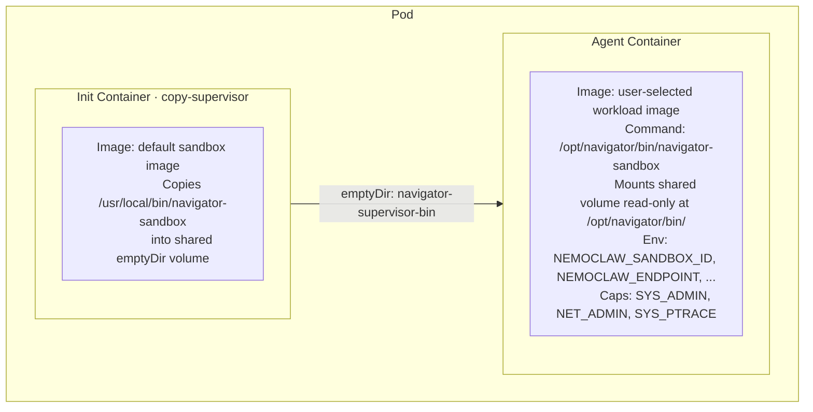

# Sandbox Custom Containers

Users can run `nemoclaw sandbox create --from <source>` to launch a sandbox with a custom container image while keeping the `navigator-sandbox` process supervisor in control.

## The `--from` Flag

The `--from` flag accepts four kinds of input:

| Input | Example | Behavior |
|-------|---------|----------|
| **Community sandbox name** | `--from openclaw` | Resolves to `ghcr.io/nvidia/nemoclaw-community/sandboxes/openclaw:latest` |
| **Dockerfile path** | `--from ./Dockerfile` | Builds the image, pushes it into the cluster, then creates the sandbox |
| **Directory with Dockerfile** | `--from ./my-sandbox/` | Uses the directory as the build context |
| **Full image reference** | `--from myregistry.com/img:tag` | Uses the image directly |

### Resolution heuristic

The CLI classifies the value in this order:

1. **Existing file** whose name contains "Dockerfile" (case-insensitive) — treated as a Dockerfile to build.
2. **Existing directory** containing a `Dockerfile` — treated as a build context directory.
3. **Contains `/`, `:`, or `.`** — treated as a full container image reference.
4. **Otherwise** — treated as a community sandbox name, expanded to `{NEMOCLAW_COMMUNITY_REGISTRY}/{name}:latest`.

The community registry prefix defaults to `ghcr.io/nvidia/nemoclaw-community/sandboxes` and can be overridden with the `NEMOCLAW_COMMUNITY_REGISTRY` environment variable.

### Dockerfile build flow

When `--from` points to a Dockerfile or directory, the CLI:

1. Builds the image locally via the Docker daemon (respecting `.dockerignore`).
2. Pushes it into the cluster's containerd runtime using `docker save` / `ctr import`.
3. Creates the sandbox with the resulting image tag.

## How It Works

When the resolved image differs from the server's default sandbox image, the server activates **supervisor bootstrap mode**. The supervisor binary is side-loaded from the default sandbox image via a Kubernetes init container:



The server applies three transforms to the pod template (`sandbox/mod.rs`):

1. Adds an `emptyDir` volume named `navigator-supervisor-bin`.
2. Injects a `copy-supervisor` init container that uses the default sandbox image and runs `cp /usr/local/bin/navigator-sandbox /opt/navigator/bin/navigator-sandbox`.
3. Overrides the agent container's `command` to `/opt/navigator/bin/navigator-sandbox` and adds a read-only volume mount for the supervisor binary.

These transforms apply to both generated templates and user-provided `pod_template` overrides.

## CLI Usage

### Creating a sandbox from a community image

```bash
nemoclaw sandbox create --from openclaw
```

### Creating a sandbox with a custom image

```bash
nemoclaw sandbox create --from myimage:latest -- echo "hello from custom container"
```

When `--from` is set the CLI clears the default `run_as_user`/`run_as_group` policy (which expects a `sandbox` user) so that arbitrary images that lack that user can start without error.

### Building from a Dockerfile in one step

```bash
nemoclaw sandbox create --from ./Dockerfile -- echo "built and running"
nemoclaw sandbox create --from ./my-sandbox/  # directory with Dockerfile
```

## Supervisor Behavior in Custom Images

The `navigator-sandbox` supervisor adapts to arbitrary environments:

- **Log file fallback**: Attempts to open `/var/log/navigator.log` for append; silently falls back to stdout-only logging if the path is not writable.
- **Command resolution**: Executes the command from CLI args, then the `NEMOCLAW_SANDBOX_COMMAND` env var (set to `sleep infinity` by the server), then `/bin/bash` as a last resort.
- **Network namespace**: Requires successful namespace creation for proxy isolation; startup fails in proxy mode if required capabilities (`CAP_NET_ADMIN`, `CAP_SYS_ADMIN`) or `iproute2` are unavailable.

## Design Decisions

| Decision | Rationale |
|----------|-----------|
| Unified `--from` flag | Single entry point for community names, Dockerfiles, directories, and image refs — removes the need to know registry paths |
| Community name resolution | Bare names like `openclaw` expand to the GHCR community registry, making the common case simple |
| Auto build+push for Dockerfiles | Eliminates the two-step `image push` + `create` workflow for local development |
| `NEMOCLAW_COMMUNITY_REGISTRY` env var | Allows organizations to host their own community sandbox registry |
| Init container side-load | Avoids rebuilding every workload image with the supervisor binary baked in |
| `emptyDir` shared volume | Zero-config, no PVC needed, ephemeral by design |
| Read-only mount in agent | Supervisor binary cannot be tampered with by the workload |
| Command override | Ensures `navigator-sandbox` is the entrypoint regardless of the image's default CMD |
| Clear `run_as_user/group` for custom images | Prevents startup failure when the image lacks the default `sandbox` user |
| Non-fatal log file init | `/var/log/navigator.log` may be unwritable in arbitrary images; falls back to stdout |
| `docker save` / `ctr import` for push | Avoids requiring a registry for local dev; images land directly in the k3s containerd store |

## Limitations

- Distroless / `FROM scratch` images are not supported (the supervisor needs glibc, `/proc`, and a shell for the init container `cp`)
- Missing `iproute2` (or required capabilities) blocks startup in proxy mode because namespace isolation is mandatory
- The init container assumes the supervisor binary is at `/usr/local/bin/navigator-sandbox` in the default sandbox image
