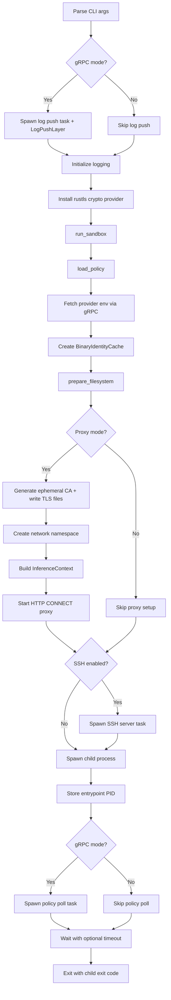
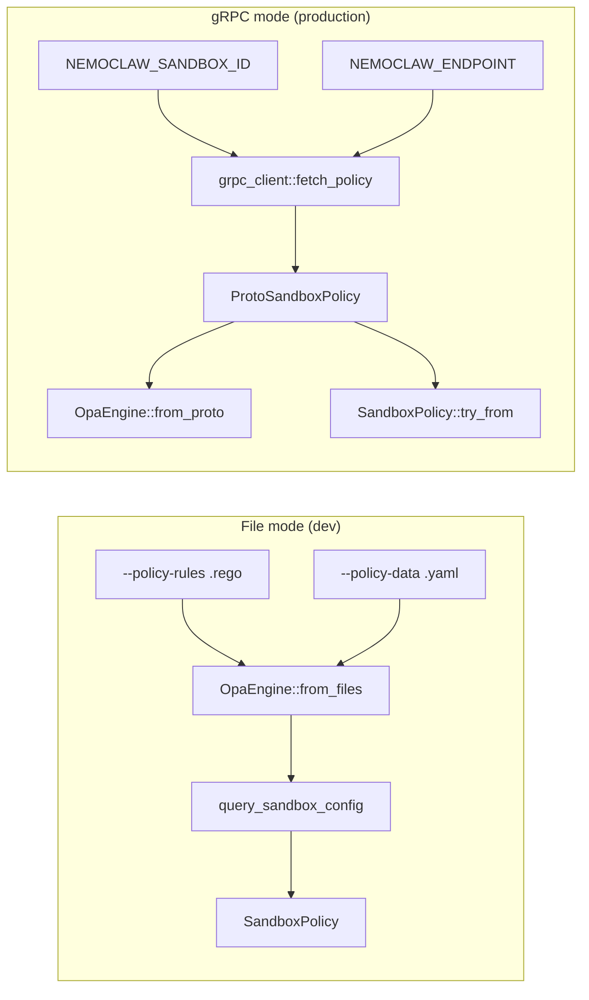
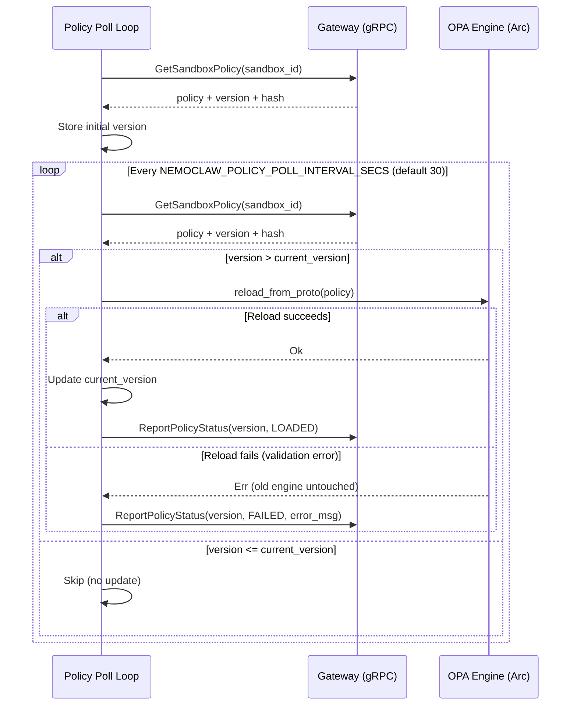
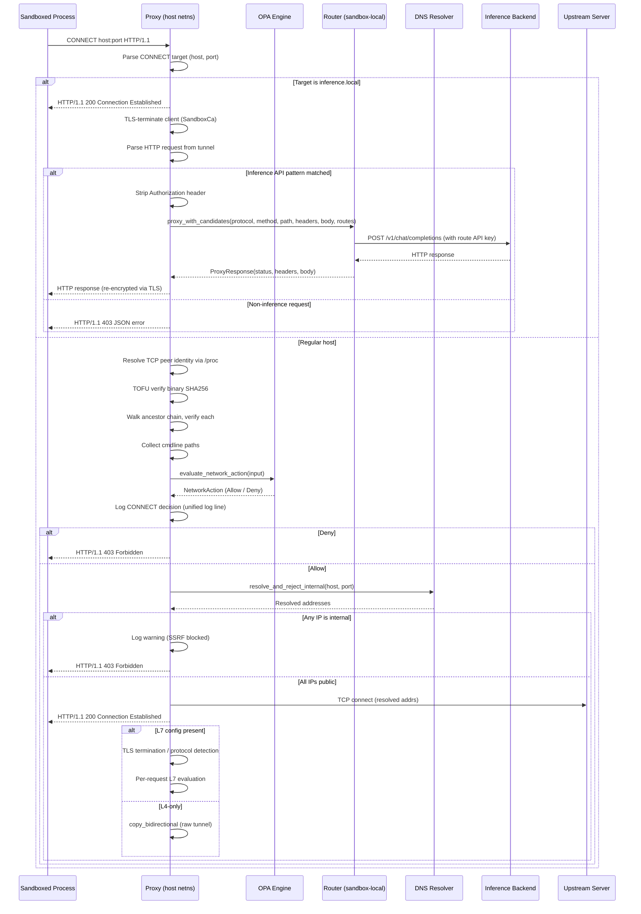
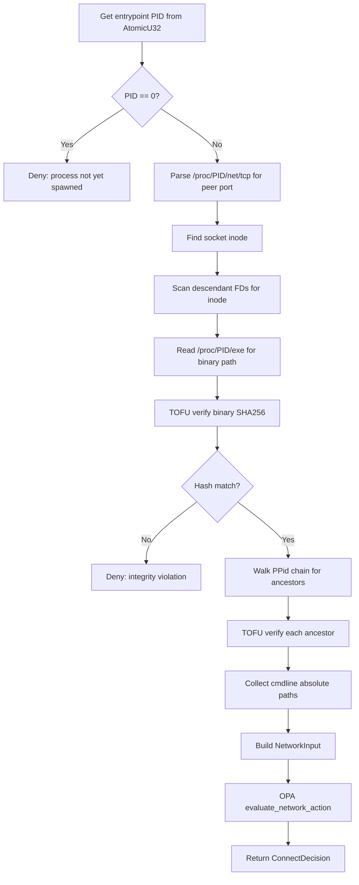
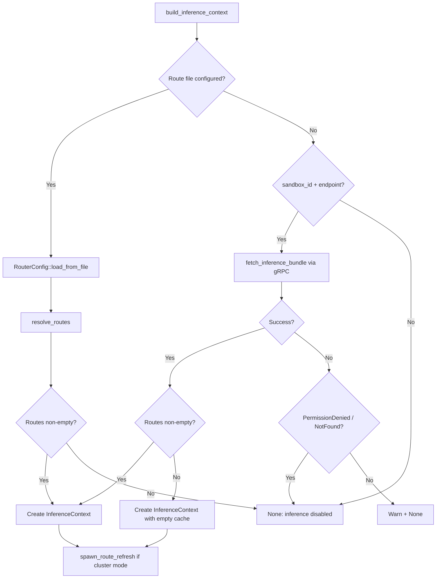
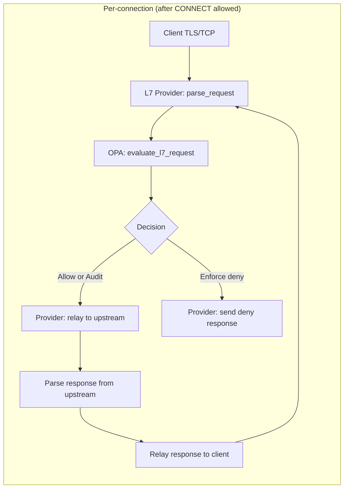
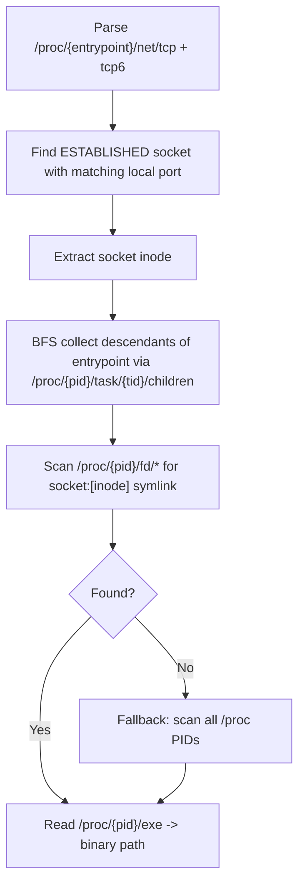
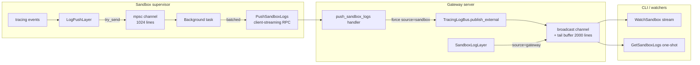
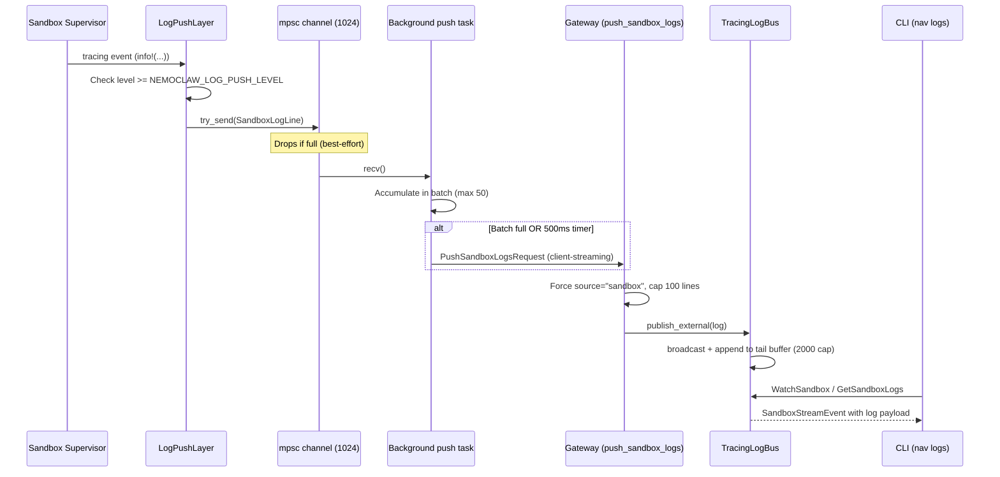

# Sandbox Architecture

The sandbox binary isolates a user-specified command inside a child process with policy-driven enforcement. It combines Linux kernel mechanisms (Landlock, seccomp, network namespaces) with an application-layer HTTP CONNECT proxy to provide filesystem, syscall, and network isolation. An embedded OPA/Rego policy engine evaluates every outbound network connection against per-binary rules, and an optional L7 inspection layer examines individual HTTP requests within allowed tunnels.

## Source File Index

All paths are relative to `crates/navigator-sandbox/src/`.

| File | Purpose |
|------|---------|
| `main.rs` | CLI entry point, argument parsing via `clap`, dual-output logging setup, log push layer initialization |
| `lib.rs` | `run_sandbox()` orchestration -- the main startup sequence |
| `log_push.rs` | `LogPushLayer` tracing layer and `spawn_log_push_task()` background batching/streaming to gateway |
| `policy.rs` | `SandboxPolicy`, `NetworkPolicy`, `ProxyPolicy`, `LandlockPolicy`, `ProcessPolicy` structs and proto conversions |
| `opa.rs` | OPA/Rego policy engine using `regorus` crate -- network evaluation, sandbox config queries, L7 endpoint queries |
| `process.rs` | `ProcessHandle` for spawning child processes, privilege dropping, signal handling |
| `proxy.rs` | HTTP CONNECT proxy with OPA evaluation, process-identity binding, inference interception, and L7 dispatch |
| `ssh.rs` | Embedded SSH server (`russh` crate) with PTY support and handshake verification |
| `identity.rs` | `BinaryIdentityCache` -- SHA256 trust-on-first-use binary integrity |
| `procfs.rs` | `/proc` filesystem reading for TCP peer identity resolution and ancestor chain walking |
| `grpc_client.rs` | gRPC client for fetching policy, provider environment, inference route bundles, policy polling/status reporting, and log push (`CachedNavigatorClient`) |
| `sandbox/mod.rs` | Platform abstraction -- dispatches to Linux or no-op |
| `sandbox/linux/mod.rs` | Linux composition: Landlock then seccomp |
| `sandbox/linux/landlock.rs` | Filesystem isolation via Landlock LSM (ABI V1) |
| `sandbox/linux/seccomp.rs` | Syscall filtering via BPF on `SYS_socket` |
| `sandbox/linux/netns.rs` | Network namespace creation, veth pair setup, cleanup on drop |
| `l7/mod.rs` | L7 types (`L7Protocol`, `TlsMode`, `EnforcementMode`, `L7EndpointConfig`), config parsing, validation, access preset expansion |
| `l7/inference.rs` | Inference API pattern detection (`detect_inference_pattern()`), HTTP request/response parsing and formatting for intercepted inference connections |
| `l7/tls.rs` | Ephemeral CA generation (`SandboxCa`), per-hostname leaf cert cache (`CertCache`), TLS termination/connection helpers |
| `l7/relay.rs` | Protocol-aware bidirectional relay with per-request OPA evaluation |
| `l7/rest.rs` | HTTP/1.1 request/response parsing, body framing (Content-Length, chunked), deny response generation |
| `l7/provider.rs` | `L7Provider` trait and `L7Request`/`BodyLength` types |

## Startup and Orchestration

The `run_sandbox()` function in `crates/navigator-sandbox/src/lib.rs` is the main orchestration entry point. It executes the following steps in order.

### Orchestration flow



### Step-by-step detail

1. **Policy loading** (`load_policy()`):
   - Priority 1: `--policy-rules` + `--policy-data` provided -- load OPA engine from local Rego file and YAML data file via `OpaEngine::from_files()`. Query `query_sandbox_config()` for filesystem/landlock/process settings. Network mode forced to `Proxy`.
   - Priority 2: `--sandbox-id` + `--navigator-endpoint` provided -- fetch typed proto policy via `grpc_client::fetch_policy()`. Create OPA engine via `OpaEngine::from_proto()` using baked-in Rego rules. Convert proto to `SandboxPolicy` via `TryFrom`, which always forces `NetworkMode::Proxy` so that all egress passes through the proxy and the `inference.local` virtual host is always addressable.
   - Neither present: return fatal error.
   - Output: `(SandboxPolicy, Option<Arc<OpaEngine>>)`

2. **Provider environment fetching**: If sandbox ID and endpoint are available, call `grpc_client::fetch_provider_environment()` to get a `HashMap<String, String>` of credential environment variables. On failure, log a warning and continue with an empty map.

3. **Binary identity cache**: If OPA engine is active, create `Arc<BinaryIdentityCache::new()>` for SHA256 TOFU enforcement.

4. **Filesystem preparation** (`prepare_filesystem()`): For each path in `filesystem.read_write`, create the directory if it does not exist and `chown` to the configured `run_as_user`/`run_as_group`. Runs as the supervisor (root) before forking.

5. **TLS state for L7 inspection** (proxy mode only):
   - Generate ephemeral CA via `SandboxCa::generate()` using `rcgen`
   - Write CA cert PEM and combined bundle (system CAs + sandbox CA) to `/etc/navigator-tls/`
   - Add the TLS directory to `policy.filesystem.read_only` so Landlock allows the child to read it
   - Build upstream `ClientConfig` with Mozilla root CAs via `webpki_roots`
   - Create `Arc<ProxyTlsState>` wrapping a `CertCache` and the upstream config

6. **Network namespace** (Linux, proxy mode only):
   - `NetworkNamespace::create()` builds the veth pair and namespace
   - Opens `/var/run/netns/sandbox-{uuid}` as an FD for later `setns()`
   - On failure: return a fatal startup error (fail-closed)

7. **Proxy startup** (proxy mode only):
   - Validate that OPA engine and identity cache are present
   - Determine bind address: on Linux, use the netns veth host IP (netns creation is required and startup already aborted if it failed); on non-Linux, use `policy.network.proxy.http_addr`
   - Build `InferenceContext` via `build_inference_context()` which resolves routes from one of two sources (see [Inference routing context](#inference-routing-context) below)
   - `ProxyHandle::start_with_bind_addr()` binds a `TcpListener` and spawns an accept loop, passing the inference context to each connection handler

8. **SSH server** (optional): If `--ssh-listen-addr` is provided, spawn an async task running `ssh::run_ssh_server()` with the policy, workdir, netns FD, proxy URL, CA paths, and provider env.

9. **Child process spawning** (`ProcessHandle::spawn()`):
   - Build `tokio::process::Command` with inherited stdio and `kill_on_drop(true)`
   - Set environment variables: `NEMOCLAW_SANDBOX=1`, provider credentials, proxy URLs, TLS trust store paths
   - Pre-exec closure (async-signal-safe): `setpgid` (if non-interactive) -> `setns` (enter netns) -> `drop_privileges` -> `sandbox::apply` (Landlock + seccomp)

10. **Store entrypoint PID**: `entrypoint_pid.store(pid, Ordering::Release)` so the proxy can resolve TCP peer identity via `/proc`.

11. **Spawn policy poll task** (gRPC mode only): If `sandbox_id`, `navigator_endpoint`, and an OPA engine are all present, spawn `run_policy_poll_loop()` as a background tokio task. This task polls the gateway for policy updates and hot-reloads the OPA engine when a new version is detected. See [Policy Reload Lifecycle](#policy-reload-lifecycle) for details.

12. **Wait with timeout**: If `--timeout > 0`, wrap `handle.wait()` in `tokio::time::timeout()`. On timeout, kill the process and return exit code 124.

## Policy Model

Policy data structures live in `crates/navigator-sandbox/src/policy.rs`.

```rust
pub struct SandboxPolicy {
    pub version: u32,
    pub filesystem: FilesystemPolicy,
    pub network: NetworkPolicy,
    pub landlock: LandlockPolicy,
    pub process: ProcessPolicy,
}

pub struct FilesystemPolicy {
    pub read_only: Vec<PathBuf>,     // Landlock read-only allowlist
    pub read_write: Vec<PathBuf>,    // Landlock read-write allowlist (auto-created, chowned)
    pub include_workdir: bool,       // Add --workdir to read_write (default: true)
}

pub struct NetworkPolicy {
    pub mode: NetworkMode,           // Block | Proxy | Allow
    pub proxy: Option<ProxyPolicy>,
}

pub struct ProxyPolicy {
    pub http_addr: Option<SocketAddr>, // Loopback bind address when not using netns
}

pub struct LandlockPolicy {
    pub compatibility: LandlockCompatibility, // BestEffort | HardRequirement
}

pub struct ProcessPolicy {
    pub run_as_user: Option<String>,
    pub run_as_group: Option<String>,
}
```

### Network mode derivation

The network mode determines which enforcement mechanisms activate:

| Mode | Seccomp | Network namespace | Proxy | Use case |
|------|---------|-------------------|-------|----------|
| `Block` | Blocks `AF_INET`, `AF_INET6` + others | No | No | No network access at all |
| `Proxy` | Blocks `AF_NETLINK`, `AF_PACKET`, `AF_BLUETOOTH`, `AF_VSOCK` (allows `AF_INET`/`AF_INET6`) | Yes (Linux) | Yes | Controlled network via proxy + OPA |
| `Allow` | No seccomp filter | No | No | Unrestricted network (seccomp skipped entirely) |

In gRPC mode, the mode is always `Proxy`. The `SandboxPolicy::try_from()` conversion forces `NetworkMode::Proxy` unconditionally so that all egress passes through the proxy and the `inference.local` virtual host is always addressable. In file mode, the mode is also always `Proxy` (the presence of `--policy-rules` implies network policy evaluation).

### Policy loading modes



## OPA Policy Engine

The OPA engine lives in `crates/navigator-sandbox/src/opa.rs` and uses the `regorus` crate -- a pure-Rust Rego evaluator with no external OPA daemon dependency.

### Baked-in rules

The Rego rules are compiled into the binary via `include_str!("../data/sandbox-policy.rego")`. The package is `navigator.sandbox`. Key rules:

| Rule | Type | Purpose |
|------|------|---------|
| `allow_network` | bool | L4 allow/deny decision for a CONNECT request |
| `network_action` | string | Routing decision: `"allow"` or `"deny"` |
| `deny_reason` | string | Human-readable deny reason |
| `matched_network_policy` | string | Name of the matched policy rule |
| `matched_endpoint_config` | object | Full endpoint config for L7 inspection lookup |
| `allow_request` | bool | L7 per-request allow/deny decision |
| `request_deny_reason` | string | L7 deny reason |
| `filesystem_policy` | object | Static filesystem config passthrough |
| `landlock_policy` | object | Static Landlock config passthrough |
| `process_policy` | object | Static process config passthrough |

### `OpaEngine` struct

```rust
pub struct OpaEngine {
    engine: Mutex<regorus::Engine>,
}
```

The inner `regorus::Engine` requires `&mut self` for evaluation, so access is serialized via `Mutex`. This is acceptable because policy evaluation completes in microseconds and contention is low (one evaluation per CONNECT request at the L4 layer).

### Loading methods

- **`from_files(policy_path, data_path)`**: Load a user-supplied `.rego` file and YAML data file. Preprocesses data to expand access presets and validate L7 config.
- **`from_strings(policy, data_yaml)`**: Load from string content (used in tests).
- **`from_proto(proto_policy)`**: Uses the baked-in Rego rules. Converts the proto's typed fields to JSON under the `sandbox` key (matching `data.sandbox.*` references). Validates L7 config, then expands access presets.

All loading methods run the same preprocessing pipeline: L7 validation (errors block startup, warnings are logged), then access preset expansion (e.g., `access: "read-only"` becomes explicit `rules` with GET/HEAD/OPTIONS).

### Network evaluation

Two evaluation methods exist: `evaluate_network()` for the legacy bool-based path, and `evaluate_network_action()` for the two-state routing path used by the proxy.

#### `evaluate_network(input: &NetworkInput) -> Result<PolicyDecision>`

Input JSON shape:
```json
{
  "exec": {
    "path": "/usr/bin/curl",
    "ancestors": ["/usr/bin/bash", "/usr/bin/node"],
    "cmdline_paths": ["/usr/local/bin/claude"]
  },
  "network": {
    "host": "api.example.com",
    "port": 443
  }
}
```

Evaluates three Rego rules:
1. `data.navigator.sandbox.allow_network` -> bool
2. `data.navigator.sandbox.deny_reason` -> string
3. `data.navigator.sandbox.matched_network_policy` -> string (or `Undefined`)

Returns `PolicyDecision { allowed, reason, matched_policy }`.

#### `evaluate_network_action(input: &NetworkInput) -> Result<NetworkAction>`

Uses the same input JSON shape as `evaluate_network()`. Evaluates the `data.navigator.sandbox.network_action` Rego rule, which returns one of two string values:

- `"allow"` -- endpoint + binary explicitly matched in a network policy
- `"deny"` -- network connections not allowed by policy

The Rego logic:
1. If `network_policy_for_request` exists (endpoint + binary match), return `"allow"`
2. Default: `"deny"`

Returns `NetworkAction`, an enum with two variants:

```rust
pub enum NetworkAction {
    Allow { matched_policy: Option<String> },
    Deny { reason: String },
}
```

The proxy calls `evaluate_network_action()` (not `evaluate_network()`) as its main decision path. Connections to the `inference.local` virtual host bypass OPA evaluation entirely and are handled by the [inference interception](#inference-interception) path before the OPA check.

### L7 endpoint config query

After L4 allows a connection, `query_endpoint_config(input)` evaluates `data.navigator.sandbox.matched_endpoint_config` to get the full endpoint object. If the endpoint has a `protocol` field, `l7::parse_l7_config()` extracts the L7 config for protocol-aware inspection.

### Engine cloning for L7

`clone_engine_for_tunnel()` clones the inner `regorus::Engine`. With the `arc` feature, this shares compiled policy via `Arc` and only duplicates interpreter state (microseconds). The cloned engine is wrapped in its own `std::sync::Mutex` and used by the L7 relay without contention on the main engine.

### Hot reload

Two reload methods exist:

- **`reload(policy, data_yaml)`**: Builds a new engine from raw Rego + YAML strings and atomically replaces the inner engine. Used in tests and by the file-mode path.
- **`reload_from_proto(proto)`**: Builds a new engine through the same validated pipeline as `from_proto()` -- proto-to-JSON conversion, L7 validation, access preset expansion -- then atomically swaps the inner `regorus::Engine`. On success, all subsequent `evaluate_network_action()` and `query_endpoint_config()` calls use the new policy. On failure (e.g., L7 validation errors), the previous engine is untouched (last-known-good behavior). This is the method used by the policy poll loop for live reloads in gRPC mode.

Both methods hold the `Mutex` only for the final swap (`*engine = new_engine`), so evaluation is blocked for only the duration of a pointer-sized assignment.

## Policy Reload Lifecycle

**File:** `crates/navigator-sandbox/src/lib.rs` (`run_policy_poll_loop()`)

In gRPC mode, the sandbox can receive policy updates at runtime without restarting. A background task polls the gateway for new policy versions and hot-reloads the OPA engine when changes are detected. Only **dynamic** policy domains (network rules) can change at runtime; **static** domains (filesystem, Landlock, process) are applied once in the pre-exec closure and cannot be modified after the child process spawns.

### Dynamic vs static policy domains

| Domain | Mutable at runtime | Applied where | Reason |
|--------|-------------------|---------------|--------|
| `network_policies` | Yes | OPA engine (proxy evaluates per-CONNECT) | Engine swap updates all future evaluations |
| `filesystem` | No | Landlock LSM in pre-exec | Kernel-enforced; cannot be modified after `restrict_self()` |
| `landlock` | No | Landlock LSM in pre_exec | Configuration for the above; same restriction |
| `process` | No | `setuid`/`setgid` in pre-exec | Privileges dropped irrevocably before exec |

The gateway's `UpdateSandboxPolicy` RPC enforces this boundary: it rejects any update where the static fields (`filesystem`, `landlock`, `process`) differ from the version 1 (creation-time) policy. It also rejects updates that would change the network mode (e.g., adding `network_policies` to a sandbox that started in `Block` mode), because the network namespace and proxy infrastructure are set up once at startup.

### Poll loop



The `run_policy_poll_loop()` function in `crates/navigator-sandbox/src/lib.rs` implements this loop:

1. **Connect once**: Create a `CachedNavigatorClient` that holds a persistent mTLS channel to the gateway. This avoids TLS renegotiation on every poll.
2. **Fetch initial version**: Call `poll_policy(sandbox_id)` to establish the baseline `current_version`. On failure, log a warning and retry on the next interval.
3. **Poll loop**: Sleep for the configured interval, then call `poll_policy()` again.
4. **Version comparison**: If `result.version <= current_version`, skip. The version is a monotonically increasing `u32` per sandbox.
5. **Reload attempt**: Call `opa_engine.reload_from_proto(&result.policy)`. This runs the full `from_proto()` pipeline on the new policy, then atomically swaps the inner engine.
6. **Status reporting**: On success, report `PolicyStatus::Loaded` to the gateway via `ReportPolicyStatus` RPC. On failure, report `PolicyStatus::Failed` with the error message. Status report failures are logged but do not affect the poll loop.

### `CachedNavigatorClient`

**File:** `crates/navigator-sandbox/src/grpc_client.rs`

`CachedNavigatorClient` is a persistent gRPC client for the `Navigator` service. It wraps a `NavigatorClient<Channel>` connected once at construction and reused for all subsequent calls.

```rust
pub struct CachedNavigatorClient {
    client: NavigatorClient<Channel>,
}

pub struct PolicyPollResult {
    pub policy: ProtoSandboxPolicy,
    pub version: u32,
    pub policy_hash: String,
}
```

Methods:
- **`connect(endpoint)`**: Establish an mTLS channel and return a new client.
- **`poll_policy(sandbox_id)`**: Call `GetSandboxPolicy` RPC and return a `PolicyPollResult` containing the policy, version, and hash.
- **`report_policy_status(sandbox_id, version, loaded, error_msg)`**: Call `ReportPolicyStatus` RPC with the appropriate `PolicyStatus` enum value (`Loaded` or `Failed`).
- **`raw_client()`**: Return a clone of the underlying `NavigatorClient<Channel>` for direct RPC calls (used by the log push task).

### Server-side policy versioning

The gateway assigns a monotonically increasing version number to each policy revision per sandbox. The `GetSandboxPolicyResponse` includes `version` and `policy_hash` fields. The `ReportPolicyStatus` RPC records which version the sandbox successfully loaded (or failed to load), enabling operators to query `GetSandboxPolicyStatus` for the current active version and load history.

Proto messages involved:
- `GetSandboxPolicyResponse` (`proto/sandbox.proto`): `policy`, `version`, `policy_hash`
- `ReportPolicyStatusRequest` (`proto/navigator.proto`): `sandbox_id`, `version`, `status` (enum), `load_error`
- `PolicyStatus` enum: `PENDING`, `LOADED`, `FAILED`, `SUPERSEDED`
- `SandboxPolicyRevision` (`proto/navigator.proto`): Full revision metadata including `created_at_ms`, `loaded_at_ms`

### Failure modes

| Condition | Behavior |
|-----------|----------|
| Gateway unreachable during poll | Log at debug level, retry on next interval |
| Initial version fetch fails | Log warning, retry on next interval (poll loop continues) |
| `reload_from_proto()` fails (L7 validation error) | Log warning, keep last-known-good engine, report FAILED status |
| Status report RPC fails | Log warning, poll loop continues unaffected |
| Poll interval env var unparseable | Fall back to default (30 seconds) |

## Linux Enforcement

All enforcement code runs in the child process's pre-exec closure -- after `fork()` but before `exec()`. The application order is: `setpgid` -> `setns` (netns) -> `drop_privileges` -> `sandbox::apply` (Landlock then seccomp).

### Landlock filesystem isolation

**File:** `crates/navigator-sandbox/src/sandbox/linux/landlock.rs`

Landlock restricts the child process's filesystem access to an explicit allowlist.

1. Build path lists from `filesystem.read_only` and `filesystem.read_write`
2. If `include_workdir` is true, add the working directory to `read_write`
3. If both lists are empty, skip Landlock entirely (no-op)
4. Create a Landlock ruleset targeting ABI V1:
   - Read-only paths receive `AccessFs::from_read(abi)` rights
   - Read-write paths receive `AccessFs::from_all(abi)` rights
5. Call `ruleset.restrict_self()` -- this applies to the calling process and all descendants

Error behavior depends on `LandlockCompatibility`:
- `BestEffort`: Log a warning and continue without filesystem isolation
- `HardRequirement`: Return a fatal error, aborting the sandbox

### Seccomp syscall filtering

**File:** `crates/navigator-sandbox/src/sandbox/linux/seccomp.rs`

Seccomp blocks socket creation for specific address families. The filter targets a single syscall (`SYS_socket`) and inspects argument 0 (the domain).

**Always blocked** (regardless of network mode):
- `AF_NETLINK`, `AF_PACKET`, `AF_BLUETOOTH`, `AF_VSOCK`

**Additionally blocked in `Block` mode** (no proxy):
- `AF_INET`, `AF_INET6`

**Skipped entirely** in `Allow` mode.

Setup:
1. `prctl(PR_SET_NO_NEW_PRIVS, 1)` -- required before seccomp
2. `seccompiler::apply_filter()` with default action `Allow` and per-rule action `Errno(EPERM)`

In `Proxy` mode, `AF_INET`/`AF_INET6` are allowed because the sandboxed process needs to connect to the proxy over the veth pair. The network namespace ensures it can only reach the proxy's IP (`10.200.0.1`).

### Network namespace isolation

**File:** `crates/navigator-sandbox/src/sandbox/linux/netns.rs`

The network namespace creates an isolated network stack where the sandboxed process can only communicate through the proxy.

#### Topology

```
HOST NAMESPACE                          SANDBOX NAMESPACE
-----------------                       -----------------
veth-h-{uuid}                           veth-s-{uuid}
10.200.0.1/24  <------- veth pair ----> 10.200.0.2/24
     |                                       |
     v                                       v
Proxy listener                          Sandboxed process
     |                                  (default route -> 10.200.0.1)
     v
Internet (filtered by OPA policy)
```

#### Creation sequence (`NetworkNamespace::create()`)

1. Generate UUID-based short ID (first 8 chars)
2. `ip netns add sandbox-{id}` -- create the namespace
3. `ip link add veth-h-{id} type veth peer name veth-s-{id}` -- create veth pair
4. `ip link set veth-s-{id} netns sandbox-{id}` -- move sandbox veth into namespace
5. Configure host side: assign `10.200.0.1/24`, bring up
6. Configure sandbox side (inside namespace): assign `10.200.0.2/24`, bring up loopback, add default route via `10.200.0.1`
7. Open `/var/run/netns/sandbox-{id}` FD for later `setns()` calls

Each step has rollback on failure -- if any `ip` command fails, previously created resources are cleaned up.

#### Cleanup on drop

`NetworkNamespace` implements `Drop`:
1. Close the namespace FD
2. Delete the host-side veth (`ip link delete veth-h-{id}`) -- this automatically removes the peer
3. Delete the namespace (`ip netns delete sandbox-{id}`)

#### Required capabilities

| Capability | Purpose |
|------------|---------|
| `CAP_SYS_ADMIN` | Creating network namespaces, `setns()` |
| `CAP_NET_ADMIN` | Creating veth pairs, assigning IPs, configuring routes |
| `CAP_SYS_PTRACE` | Proxy reading `/proc/<pid>/fd/` and `/proc/<pid>/exe` for processes running as a different user |

The `iproute2` package must be installed (provides the `ip` command).

If namespace creation fails (e.g., missing capabilities), startup fails in `Proxy` mode. This preserves fail-closed behavior: either network namespace isolation is active, or the sandbox does not run.

## HTTP CONNECT Proxy

**File:** `crates/navigator-sandbox/src/proxy.rs`

The proxy is an async TCP listener that accepts HTTP CONNECT requests. Each connection spawns a handler task. The proxy evaluates every CONNECT request against OPA policy with full process-identity binding, except for connections to the `inference.local` virtual host which bypass OPA and are handled by the inference interception path.

### Connection flow



### `ProxyHandle`

`ProxyHandle` wraps a `JoinHandle` and the bound address. The `Drop` implementation aborts the accept loop. `start_with_bind_addr()` accepts an optional `inference_ctx: Option<Arc<InferenceContext>>` that enables inference interception. See [Inference routing context](#inference-routing-context) for how the `InferenceContext` is constructed.

Startup steps:

1. Determine bind address: use the override (veth host IP) if provided, else fall back to `policy.http_addr`
2. Enforce loopback restriction when not using a network namespace override
3. Bind `TcpListener`, spawn accept loop
4. Each accepted connection spawns `handle_tcp_connection()` as a separate tokio task, passing the `InferenceContext` (if present) to each handler

### Request parsing

The proxy reads up to 8192 bytes (`MAX_HEADER_BYTES`) looking for `\r\n\r\n`. It validates the method is `CONNECT` (returning 403 for anything else with a structured log) and parses the `host:port` target.

### `inference.local` interception (pre-OPA fast path)

After parsing the CONNECT target, the proxy checks whether the hostname (lowercased) matches `INFERENCE_LOCAL_HOST` (`"inference.local"`). If it does, the proxy immediately sends `200 Connection Established` and hands the connection to `handle_inference_interception()`, bypassing OPA evaluation entirely. This design ensures `inference.local` is always addressable in proxy mode regardless of what network policies are configured.

### OPA evaluation with identity binding (`evaluate_opa_tcp()`)

For all non-`inference.local` CONNECT targets, the proxy performs OPA evaluation with process-identity binding. This is the core security evaluation path, Linux-only (requires `/proc`).



On non-Linux platforms, `evaluate_opa_tcp()` always denies with the reason "identity binding unavailable on this platform".

### `ConnectDecision` struct

```rust
struct ConnectDecision {
    action: NetworkAction,          // Allow or Deny
    binary: Option<PathBuf>,
    binary_pid: Option<u32>,
    ancestors: Vec<PathBuf>,
    cmdline_paths: Vec<PathBuf>,
}
```

The `action` field carries the matched policy name (for `Allow`) or the deny reason (for `Deny`) inside the `NetworkAction` enum variants.

### Unified logging

Every CONNECT request to a non-`inference.local` target produces an `info!()` log line with all context: source/destination addresses, binary path, PID, ancestor chain, cmdline paths, action (`allow` or `deny`), engine, matched policy, and deny reason. Inference interception failures produce a separate `info!()` log with `action=deny` and the denial reason.

### SSRF protection (internal IP rejection)

After OPA allows a connection, the proxy resolves DNS and rejects any host that resolves to an internal IP address (loopback, RFC 1918 private, link-local, or IPv4-mapped IPv6 equivalents). This defense-in-depth measure prevents SSRF attacks where an allowed hostname is pointed at internal infrastructure. The check is implemented by `resolve_and_reject_internal()` which calls `tokio::net::lookup_host()` and validates every resolved address via `is_internal_ip()`. If any resolved IP is internal, the connection receives a `403 Forbidden` response and a warning is logged. See [SSRF Protection](security-policy.md#ssrf-protection-internal-ip-rejection) for the full list of blocked ranges.

### Inference interception

When a CONNECT target is `inference.local`, the proxy TLS-terminates the client side and inspects the HTTP traffic to detect inference API calls. Matched requests are executed locally via the `navigator-router` crate. The function `handle_inference_interception()` implements this path and returns an `InferenceOutcome`:

```rust
enum InferenceOutcome {
    /// At least one request was successfully routed to a local inference backend.
    Routed,
    /// The connection was denied (TLS failure, non-inference request, etc.).
    Denied { reason: String },
}
```

Every exit path in `handle_inference_interception` produces an explicit outcome. The `Denied` variant carries a human-readable reason describing the failure. At the call site in `handle_tcp_connection`, `Denied` outcomes trigger a structured CONNECT deny log with the denial reason. The `route_inference_request` helper returns `Result<bool>` where `true` means the request was routed and `false` means the request was not allowed by policy and was denied inline.

The interception steps:

1. **TLS termination**: The proxy responds with `200 Connection Established`, then performs TLS termination using the existing `SandboxCa` / `CertCache` infrastructure (same as L7 inspection). The client sees a valid certificate for the target hostname. If TLS termination fails, returns `Denied { reason: "TLS handshake failed: ..." }`.

2. **HTTP request parsing**: Reads HTTP/1.1 requests from the decrypted tunnel using `try_parse_http_request()` from `l7/inference.rs`. Supports both `Content-Length` and `Transfer-Encoding: chunked` request framing (chunked bodies are decoded before forwarding). Uses a growable buffer starting at 64 KiB (`INITIAL_INFERENCE_BUF`) up to 10 MiB (`MAX_INFERENCE_BUF`). Returns `413 Payload Too Large` if the limit is exceeded (and `Denied { reason: "payload too large" }` if no request was previously routed).

3. **Inference pattern detection**: `detect_inference_pattern()` checks the request method and path against the configured patterns. Default patterns from `default_patterns()`:

   | Method | Path | Protocol | Kind |
   |--------|------|----------|------|
   | `POST` | `/v1/chat/completions` | `openai_chat_completions` | `chat_completion` |
   | `POST` | `/v1/completions` | `openai_completions` | `completion` |
   | `POST` | `/v1/responses` | `openai_responses` | `responses` |
   | `POST` | `/v1/messages` | `anthropic_messages` | `messages` |
   | `GET` | `/v1/models` | `model_discovery` | `models_list` |
   | `GET` | `/v1/models/*` | `model_discovery` | `models_get` |

   Pattern matching strips query strings. Exact path comparison is used for most patterns; the `/v1/models/*` pattern matches `/v1/models` itself or any path under `/v1/models/` (e.g., `/v1/models/gpt-4.1`).

4. **Header sanitization**: For matched inference requests, the proxy strips credential headers (`Authorization`, `x-api-key`) and framing/hop-by-hop headers (`host`, `content-length`, `transfer-encoding`, `connection`, etc.). The router rebuilds correct framing for the forwarded body.

5. **Local routing**: Matched requests are executed by calling `Router::proxy_with_candidates()` directly, passing the detected protocol, HTTP method, path, sanitized headers, body, and the cached `ResolvedRoute` list from `InferenceContext`. The router selects the first route whose `protocols` list contains the source protocol (see [Inference Router](inference-routing.md#inference-router) for route selection details). When forwarding to the backend, the router rewrites the request: the route's `api_key` replaces the `Authorization` header, the `Host` header is set to the backend endpoint, and the `"model"` field in the JSON request body is replaced with the route's configured `model` value. If the request body is not valid JSON or does not contain a `"model"` key, the body is forwarded unchanged.

6. **Response handling**:
   - On success: the router's response (status code, headers, body) is formatted as an HTTP/1.1 response and sent back to the client after stripping response framing/hop-by-hop headers (`transfer-encoding`, `content-length`, `connection`, etc.)
   - On router failure: the error is mapped to an HTTP status code via `router_error_to_http()` and returned as a JSON error body (see error table below)
   - Empty route cache: returns `503` JSON error (`{"error": "cluster inference is not configured"}`)
   - Non-inference requests: returns `403 Forbidden` with a JSON error body (`{"error": "connection not allowed by policy"}`)

7. **Connection lifecycle**: The handler loops to process multiple HTTP requests on the same connection (HTTP keep-alive). The loop ends when the client closes the connection or an unrecoverable error occurs. Once at least one request has been successfully routed (`routed_any` flag), subsequent failures (client disconnect, I/O error, payload too large, request not allowed by policy) are treated as clean termination (`InferenceOutcome::Routed`) rather than denials.

### Router error to HTTP mapping

When `Router::proxy_with_candidates()` returns an error, `router_error_to_http()` in `proxy.rs` maps it to an HTTP status code:

| `RouterError` variant | HTTP status | Response body |
|----------------------|-------------|---------------|
| `RouteNotFound(hint)` | `400` | `no route configured for route '{hint}'` |
| `NoCompatibleRoute(protocol)` | `400` | `no compatible route for source protocol '{protocol}'` |
| `Unauthorized(msg)` | `401` | `{msg}` |
| `UpstreamUnavailable(msg)` | `503` | `{msg}` |
| `UpstreamProtocol(msg)` / `Internal(msg)` | `502` | `{msg}` |

### Inference routing context

**Files:** `crates/navigator-sandbox/src/lib.rs` (`build_inference_context`, `bundle_to_resolved_routes`, `spawn_route_refresh`), `crates/navigator-sandbox/src/proxy.rs` (`InferenceContext`)

The sandbox executes inference requests locally using the `navigator-router` crate. `InferenceContext` holds the router, API patterns, and a cached set of resolved routes:

```rust
pub struct InferenceContext {
    pub patterns: Vec<InferenceApiPattern>,
    router: navigator_router::Router,
    routes: Arc<tokio::sync::RwLock<Vec<navigator_router::config::ResolvedRoute>>>,
}
```

`build_inference_context()` in `lib.rs` resolves routes from one of two sources.

#### Design decision: standalone capability

The sandbox is designed to operate both as part of a cluster and as a standalone component without any cluster infrastructure. This is intentional -- it enables local development workflows (e.g., a developer running a sandbox against a local LLM server without deploying the full stack), CI/CD environments where sandboxes run as isolated test harnesses, and air-gapped deployments where the gateway is not available. Everything the sandbox needs -- policy, inference routes -- can be provided without any dependency on the control plane.

#### Route sources (priority order)

1. **Route file (standalone mode)**: `--inference-routes` / `NEMOCLAW_INFERENCE_ROUTES` points to a YAML file parsed by `RouterConfig::load_from_file()`. Routes are resolved via `config.resolve_routes()`. File loading or parsing errors are fatal (fail-fast), but an empty route list gracefully disables inference routing (returns `None`). The route file always takes precedence -- if both a route file and cluster credentials are present, the route file wins and the cluster bundle is not fetched.

2. **Cluster bundle (cluster mode)**: When `navigator_endpoint` is available (and no route file is configured), routes are fetched from the gateway via `grpc_client::fetch_inference_bundle()`, which calls the `GetInferenceBundle` gRPC RPC on the `Inference` service. The RPC takes no arguments (the bundle is cluster-scoped, not per-sandbox). The gateway returns a `GetInferenceBundleResponse` containing resolved `ResolvedRoute` entries for the managed cluster route. These proto messages are converted to router `ResolvedRoute` structs by `bundle_to_resolved_routes()`, which maps provider types to auth headers and default headers via `navigator_core::inference::auth_for_provider_type()`.

3. **No source**: If neither route file nor cluster credentials are configured, `build_inference_context()` returns `None` and inference routing is disabled.

#### Cluster mode graceful degradation

In cluster mode, `fetch_inference_bundle()` failures are handled based on the error type:
- gRPC `PermissionDenied` or `NotFound` (detected via error message string matching): sandbox has no inference policy -- inference routing is silently disabled.
- Other errors: logged as a warning, inference routing is disabled.
- Empty initial route bundle: inference routing stays enabled with an empty cache and background refresh continues.

Route sources handle empty route lists differently: file mode disables inference routing when the file resolves to zero routes, while cluster mode keeps inference routing active with an empty cache so refresh can pick up routes created later. File *loading errors* (missing file, parse failure) are fatal, while cluster *fetch errors* are non-fatal.

#### Background route cache refresh

In cluster mode (when no route file is configured), `spawn_route_refresh()` starts a background tokio task that refreshes the route cache every 30 seconds (`ROUTE_REFRESH_INTERVAL_SECS`). The task calls `fetch_inference_bundle()` on each tick and replaces the `RwLock<Vec<ResolvedRoute>>` contents. On fetch failure, the task logs a warning and keeps the stale routes. The `MissedTickBehavior::Skip` policy prevents refresh storms after temporary gateway outages.



#### API key security

`ResolvedRoute` has a custom `Debug` implementation in `crates/navigator-router/src/config.rs` that redacts the `api_key` field, printing `[REDACTED]` instead of the actual value. This prevents key leakage in log output and debug traces.

### Post-decision: L7 dispatch or raw tunnel (`Allow` path)

After a CONNECT is allowed, the SSRF check passes, and the upstream TCP connection is established:

1. **Query L7 config**: `query_l7_config()` asks the OPA engine for `matched_endpoint_config`. If the endpoint has a `protocol` field, parse it into `L7EndpointConfig`.

2. **L7 inspection** (if config present):
   - Clone the OPA engine for per-tunnel evaluation (`clone_engine_for_tunnel()`)
   - Build `L7EvalContext` with host, port, policy name, binary path, ancestors, cmdline paths
   - Branch on TLS mode:
     - `TlsMode::Terminate`: MITM via `tls_terminate_client()` + `tls_connect_upstream()`, then `relay_with_inspection()`
     - `TlsMode::Passthrough`: Peek first bytes on raw TCP; if `looks_like_http()` matches, run `relay_with_inspection()`; reject on protocol mismatch

3. **L4-only** (no L7 config): `tokio::io::copy_bidirectional()` for a raw tunnel

## L7 Protocol-Aware Inspection

**Files:** `crates/navigator-sandbox/src/l7/`

The L7 subsystem inspects application-layer traffic within CONNECT tunnels. Instead of raw `copy_bidirectional`, each request is parsed, evaluated against OPA rules, and either forwarded or blocked.

### Architecture



### Types

| Type | Definition | Purpose |
|------|-----------|---------|
| `L7Protocol` | `Rest`, `Sql` | Supported application protocols |
| `TlsMode` | `Passthrough`, `Terminate` | TLS handling strategy |
| `EnforcementMode` | `Audit`, `Enforce` | What to do on L7 deny (log-only vs block) |
| `L7EndpointConfig` | `{ protocol, tls, enforcement }` | Per-endpoint L7 configuration |
| `L7Decision` | `{ allowed, reason, matched_rule }` | Result of L7 evaluation |
| `L7RequestInfo` | `{ action, target }` | HTTP method + path for policy evaluation |

### Access presets

Policy data supports shorthand `access` presets that expand into explicit `rules` during preprocessing:

| Preset | Expands to |
|--------|-----------|
| `read-only` | `GET **`, `HEAD **`, `OPTIONS **` |
| `read-write` | `GET **`, `HEAD **`, `OPTIONS **`, `POST **`, `PUT **`, `PATCH **` |
| `full` | `* **` (all methods, all paths) |

Expansion happens in `expand_access_presets()` before the Rego engine loads the data. The `rules` and `access` fields are mutually exclusive (validated at startup).

### Policy validation

`validate_l7_policies()` runs at engine load time and returns `(errors, warnings)`:

**Errors** (block startup):
- `rules` and `access` both specified on same endpoint
- `protocol` specified without `rules` or `access`
- `tls: terminate` without a `protocol`
- `protocol: sql` with `enforcement: enforce` (SQL parsing not available in v1)
- Empty `rules` array (would deny all traffic)

**Warnings** (logged):
- `protocol: rest` on port 443 without `tls: terminate` (L7 rules ineffective on encrypted traffic)
- Unknown HTTP method in rules

### TLS termination

**File:** `crates/navigator-sandbox/src/l7/tls.rs`

TLS termination enables the proxy to inspect HTTPS traffic by performing MITM decryption.

**Ephemeral CA lifecycle:**
1. At sandbox startup, `SandboxCa::generate()` creates a self-signed CA (CN: "Navigator Sandbox CA") using `rcgen`
2. The CA cert PEM and a combined bundle (system CAs + sandbox CA) are written to `/etc/navigator-tls/`
3. The sandbox CA cert path is set as `NODE_EXTRA_CA_CERTS` (additive for Node.js)
4. The combined bundle is set as `SSL_CERT_FILE`, `REQUESTS_CA_BUNDLE`, `CURL_CA_BUNDLE` (replaces defaults for OpenSSL, Python requests, curl)

**Per-hostname leaf cert generation:**
- `CertCache` maps hostnames to `CertifiedLeaf` structs (cert chain + private key)
- First request for a hostname generates a leaf cert signed by the sandbox CA via `rcgen`
- Cache has a hard limit of 256 entries; on overflow, the entire cache is cleared (sufficient for sandbox scale)
- Each leaf cert chain contains two certs: the leaf and the CA

**Connection flow:**
1. `tls_terminate_client()`: Accept TLS from the sandboxed client using a `ServerConfig` with the hostname-specific leaf cert. ALPN: `http/1.1`.
2. `tls_connect_upstream()`: Connect TLS to the real upstream using a `ClientConfig` with Mozilla root CAs (`webpki_roots`). ALPN: `http/1.1`.
3. Proxy now holds plaintext on both sides and runs `relay_with_inspection()`.

System CA bundles are searched at well-known paths: `/etc/ssl/certs/ca-certificates.crt` (Debian/Ubuntu), `/etc/pki/tls/certs/ca-bundle.crt` (RHEL), `/etc/ssl/ca-bundle.pem` (openSUSE), `/etc/ssl/cert.pem` (Alpine/macOS).

### REST protocol provider

**File:** `crates/navigator-sandbox/src/l7/rest.rs`

Implements `L7Provider` for HTTP/1.1:

- **`parse_request()`**: Reads up to 16 KiB of headers, parses the request line (method, path), determines body framing from `Content-Length` or `Transfer-Encoding: chunked` headers. Returns `L7Request` with raw header bytes (may include overflow body bytes).

- **`relay()`**: Forwards request headers and body to upstream (handling Content-Length, chunked, and no-body cases), then reads and relays the full response back to the client.

- **`deny()`**: Sends an HTTP `403 Forbidden` JSON response with `Content-Type: application/json`, including the policy name, matched rule, and deny reason. Sets `Connection: close` and includes an `X-Navigator-Policy` header.

- **`looks_like_http()`**: Protocol detection via first-byte peek -- checks for standard HTTP method prefixes (GET, HEAD, POST, PUT, DELETE, PATCH, OPTIONS, CONNECT, TRACE).

### Per-request L7 evaluation

`relay_with_inspection()` in `crates/navigator-sandbox/src/l7/relay.rs` is the main relay loop:

1. Parse one HTTP request from client via the provider
2. Build L7 input JSON with `request.method`, `request.path`, plus the CONNECT-level context (host, port, binary, ancestors, cmdline)
3. Evaluate `data.navigator.sandbox.allow_request` and `data.navigator.sandbox.request_deny_reason`
4. Log the L7 decision (tagged `L7_REQUEST`)
5. If allowed (or audit mode): relay request to upstream and response back to client, then loop
6. If denied in enforce mode: send 403 and close the connection

## Process Identity

### SHA256 TOFU (Trust-On-First-Use)

**File:** `crates/navigator-sandbox/src/identity.rs`

`BinaryIdentityCache` wraps a `Mutex<HashMap<PathBuf, CachedBinary>>`, where
each cached entry stores:

- Hex-encoded SHA256 hash
- File fingerprint (`len`, `mtime`, `ctime`, and on Unix `dev` + `inode`)

`verify_or_cache(path)`:
- **First call for a path**: Compute SHA256 via `procfs::file_sha256()`, store as the "golden" hash plus fingerprint, return the hash.
- **Subsequent calls, unchanged fingerprint**: Return cached hash without re-hashing the file.
- **Subsequent calls, changed fingerprint**: Recompute SHA256 and compare with cached value. Return `Ok(hash)` on match; return `Err` on mismatch (binary tampered/replaced mid-sandbox).

The TOFU model means:
- No hashes are specified in policy data -- the first observed binary is trusted
- Once trusted, the binary cannot change for the sandbox's lifetime
- Both the immediate binary and all ancestor binaries are TOFU-verified

### /proc-based identity resolution

**File:** `crates/navigator-sandbox/src/procfs.rs`

The proxy resolves which binary is making each network request by inspecting `/proc`.

**`resolve_tcp_peer_identity(entrypoint_pid, peer_port) -> (PathBuf, u32)`**



Both IPv4 (`/proc/{pid}/net/tcp`) and IPv6 (`/proc/{pid}/net/tcp6`) tables are checked because some clients (notably gRPC C-core) use `AF_INET6` sockets with IPv4-mapped addresses.

**`collect_ancestor_binaries(pid, stop_pid) -> Vec<PathBuf>`**: Walk the PPid chain via `/proc/{pid}/status`, collecting `binary_path()` for each ancestor. Stops at PID 1, `stop_pid` (entrypoint), or after 64 levels (safety limit). Does not include `pid` itself.

**`collect_cmdline_paths(pid, stop_pid, exclude) -> Vec<PathBuf>`**: Extract absolute paths from `/proc/{pid}/cmdline` for the process and its ancestor chain. Captures script paths that don't appear in `/proc/{pid}/exe` -- for example, when `#!/usr/bin/env node` runs a script at `/usr/local/bin/claude`, the exe is `/usr/bin/node` but cmdline contains the script path. Paths already in `exclude` (exe-based paths) are omitted.

**`file_sha256(path) -> String`**: Read the file and compute `SHA256` via the `sha2` crate, returned as hex.

## Process Management

**File:** `crates/navigator-sandbox/src/process.rs`

### `ProcessHandle`

Wraps `tokio::process::Child` + PID. Platform-specific `spawn()` methods delegate to `spawn_impl()`.

**Environment setup** (both Linux and non-Linux):
- `NEMOCLAW_SANDBOX=1` (always set)
- Provider credentials (from `GetSandboxProviderEnvironment` RPC)
- Proxy URLs: `HTTP_PROXY`, `HTTPS_PROXY`, `ALL_PROXY` (uppercase for curl/wget), `http_proxy`, `https_proxy`, `grpc_proxy` (lowercase for gRPC C-core)
- TLS trust store: `NODE_EXTRA_CA_CERTS` (standalone CA cert), `SSL_CERT_FILE`, `REQUESTS_CA_BUNDLE`, `CURL_CA_BUNDLE` (combined bundle)

**Pre-exec closure** (runs in child after fork, before exec -- async-signal-safe):
1. `setpgid(0, 0)` if non-interactive (create new process group)
2. `setns(fd, CLONE_NEWNET)` to enter network namespace (Linux only)
3. `drop_privileges(policy)`: `initgroups()` -> `setgid()` -> `setuid()`
4. `sandbox::apply(policy, workdir)`: Landlock then seccomp

### `drop_privileges()`

Resolves user/group names from policy, then:
1. `initgroups()` to set supplementary groups (Linux only, not macOS)
2. `setgid()` to target group
3. Verify `getegid()` matches the target GID
4. `setuid()` to target user
5. Verify `geteuid()` matches the target UID
6. Verify `setuid(0)` fails (confirms root cannot be re-acquired)

The ordering is significant: `initgroups`/`setgid` must happen before `setuid` because switching user may drop the privileges needed for group manipulation. Similarly, privilege dropping must happen before Landlock because Landlock may block access to `/etc/passwd` and `/etc/group`.

Steps 3, 5, and 6 are defense-in-depth post-condition checks (CWE-250 / CERT POS37-C). All three syscalls (`geteuid`, `getegid`, `setuid`) are async-signal-safe, so they are safe to call in the `pre_exec` context. The checks add negligible overhead while guarding against hypothetical kernel-level defects that could cause `setuid`/`setgid` to return success without actually changing the effective IDs.

### `ProcessStatus`

Exit code is `code` if the process exited normally, or `128 + signal` if killed by a signal (standard Unix convention). Returns `-1` if neither is available.

### Signal handling

`kill()` sends SIGTERM, waits 100ms, then sends SIGKILL if the process is still running.

## SSH Server

**File:** `crates/navigator-sandbox/src/ssh.rs`

The embedded SSH server provides remote shell access to the sandbox. It uses the `russh` crate and allocates PTYs for interactive sessions.

### Startup

`run_ssh_server()`:
1. Generate an ephemeral Ed25519 host key via `russh::keys::PrivateKey::random()`
2. Bind a `TcpListener` to the configured address
3. Accept connections in a loop, spawning per-connection handlers

### Handshake verification

Before the SSH protocol begins, the server reads a preface line:

```
NSSH1 {token} {timestamp} {nonce} {hmac_hex}\n
```

`verify_preface()`:
1. Verify magic is `NSSH1` and exactly 5 fields
2. Verify `|now - timestamp|` is within `--ssh-handshake-skew-secs` (default 300s)
3. Compute `HMAC-SHA256(secret, "{token}|{timestamp}|{nonce}")` and compare with `{hmac_hex}`
4. Send `OK\n` on success, `ERR\n` on failure

This pre-SSH handshake authenticates the gateway-to-sandbox tunnel. After it succeeds, the SSH session uses permissive authentication (`auth_none` and `auth_publickey` both return `Accept`) since the transport is already verified.

### Shell/exec handling

The `SshHandler` implements `russh::server::Handler`:

- **`pty_request()`**: Store terminal dimensions for PTY allocation
- **`shell_request()`**: Start an interactive `/bin/bash -i`
- **`exec_request()`**: Start `/bin/bash -lc {command}`
- **`window_change_request()`**: Resize PTY via `TIOCSWINSZ` ioctl
- **`data()`**: Forward client input to the PTY via an `mpsc::channel`

### PTY child process

`spawn_pty_shell()`:
1. `openpty()` to create a master/slave PTY pair
2. Build `std::process::Command` (not tokio) with slave FDs for stdin/stdout/stderr
3. Set environment: `NEMOCLAW_SANDBOX=1`, `HOME=/sandbox`, `USER=sandbox`, `TERM={negotiated}`, proxy URLs, TLS trust store paths, provider credentials
4. Install pre-exec closure (via `unsafe_pty::install_pre_exec()`):
   - `setsid()` to create a new session
   - `TIOCSCTTY` ioctl to set the controlling terminal
   - `setns()` to enter the network namespace (Linux)
   - `drop_privileges()` then `sandbox::apply()` (Landlock + seccomp)
5. Spawn three threads:
   - **Writer thread**: Reads from `mpsc::Receiver`, writes to PTY master
   - **Reader thread**: Reads from PTY master, sends SSH channel data, sends EOF when done, signals the exit thread
   - **Exit thread**: Waits for child to exit, waits for reader to finish (ensures correct SSH protocol ordering: data -> EOF -> exit-status -> close), sends exit status and closes the channel

## Zombie Reaping (PID 1 Init Duties)

`navigator-sandbox` runs as PID 1 inside the container. In Linux, when a process exits, its parent must call `waitpid()` to collect the exit status; otherwise the process remains as a zombie. Orphaned processes (whose parent exits first) are reparented to PID 1, which becomes responsible for reaping them.

Coding agents running inside the sandbox (OpenClaw, Claude, Codex) frequently spawn background daemons and child processes. When these grandchildren are orphaned, they become PID 1's responsibility. Without reaping, they accumulate as zombies for the lifetime of the container.

**File:** `crates/navigator-sandbox/src/lib.rs`

The sandbox supervisor registers a `SIGCHLD` handler at startup and spawns a background reaper task. The reaper also runs on a 5-second interval timer as a fallback in case signals are coalesced or missed. On each wake, it loops calling `waitid(Id::All, WEXITED | WNOHANG | WNOWAIT)` to inspect exited children without consuming their status. For each exited child:

1. Check `MANAGED_CHILDREN` (a `Mutex<HashSet<i32>>`) to determine if the PID belongs to a managed child (entrypoint or SSH session process) that has an explicit waiter.
2. If managed, break out of the loop -- the explicit `child.wait()` call owns that status.
3. If not managed (an orphaned grandchild), call `waitpid(pid, WNOHANG)` to reap it.

This two-phase approach (peek with `WNOWAIT`, then selectively reap) avoids `ECHILD` races with explicit `child.wait()` calls on managed children while still collecting orphan zombies. The `MANAGED_CHILDREN` set is updated via `register_managed_child()` (at spawn) and `unregister_managed_child()` (after wait completes). This feature is Linux-only (`#[cfg(target_os = "linux")]`).

## Environment Variables Reference

### Configuration (CLI flags / env vars)

| Variable | CLI flag | Default | Purpose |
|----------|----------|---------|---------|
| `NEMOCLAW_SANDBOX_COMMAND` | (trailing args) | `/bin/bash` | Command to execute inside sandbox |
| `NEMOCLAW_SANDBOX_ID` | `--sandbox-id` | | Sandbox ID for gRPC policy fetch |
| `NEMOCLAW_ENDPOINT` | `--navigator-endpoint` | | Gateway gRPC endpoint |
| `NEMOCLAW_POLICY_RULES` | `--policy-rules` | | Path to Rego policy file |
| `NEMOCLAW_POLICY_DATA` | `--policy-data` | | Path to YAML data file |
| `NEMOCLAW_LOG_LEVEL` | `--log-level` | `warn` | Log level (trace/debug/info/warn/error) |
| `NEMOCLAW_POLICY_POLL_INTERVAL_SECS` | | `30` | Poll interval for gRPC policy updates (seconds). Only active in gRPC mode. |
| `NEMOCLAW_LOG_PUSH_LEVEL` | | `info` | Maximum tracing level for log push to gateway. Events above this level are not streamed. Only active in gRPC mode. |
| `NEMOCLAW_SSH_LISTEN_ADDR` | `--ssh-listen-addr` | | SSH server bind address |
| `NEMOCLAW_SSH_HANDSHAKE_SECRET` | `--ssh-handshake-secret` | | HMAC secret for SSH handshake |
| `NEMOCLAW_SSH_HANDSHAKE_SKEW_SECS` | `--ssh-handshake-skew-secs` | `300` | Allowed clock skew for handshake |
| `NEMOCLAW_INFERENCE_ROUTES` | `--inference-routes` | | Path to YAML inference routes file for standalone routing |

### Injected into child process

| Variable | Purpose |
|----------|---------|
| `NEMOCLAW_SANDBOX` | Always `"1"` -- signals the process is sandboxed |
| `HTTP_PROXY` / `HTTPS_PROXY` / `ALL_PROXY` | Proxy URL (uppercase, for curl/wget) |
| `http_proxy` / `https_proxy` / `grpc_proxy` | Proxy URL (lowercase, for gRPC C-core) |
| `NODE_EXTRA_CA_CERTS` | Path to sandbox CA cert PEM (Node.js, additive) |
| `SSL_CERT_FILE` | Combined CA bundle path (OpenSSL/Python/Go) |
| `REQUESTS_CA_BUNDLE` | Combined CA bundle path (Python requests) |
| `CURL_CA_BUNDLE` | Combined CA bundle path (curl/libcurl) |
| Provider credentials | From `GetSandboxProviderEnvironment` RPC (e.g., `ANTHROPIC_API_KEY`) |

### Injected into SSH child process (additional)

| Variable | Purpose |
|----------|---------|
| `HOME` | `/sandbox` |
| `USER` | `sandbox` |
| `TERM` | Negotiated terminal type (default `xterm-256color`) |

## Error Handling and Graceful Degradation

The sandbox uses `miette` for error reporting and `thiserror` for typed errors. The general principle is: fail hard on security-critical errors, degrade gracefully on non-critical ones.

| Condition | Behavior |
|-----------|----------|
| Policy fetch failure (gRPC or file) | Fatal -- sandbox cannot start without policy |
| Provider env fetch failure | Warn + continue with empty map |
| Policy poll: gateway unreachable | Debug log + retry on next interval |
| Policy poll: `reload_from_proto()` failure | Warn + keep last-known-good engine + report FAILED status to gateway |
| Policy poll: status report failure | Warn + poll loop continues |
| Landlock failure + `BestEffort` | Warn + continue without filesystem isolation |
| Landlock failure + `HardRequirement` | Fatal |
| Seccomp failure | Fatal |
| Network namespace creation failure | Fatal in `Proxy` mode (sandbox startup aborts) |
| Ephemeral CA generation failure | Warn + TLS termination disabled (L7 inspection on TLS endpoints will not work) |
| CA file write failure | Warn + TLS termination disabled |
| OPA engine Mutex lock poisoned | Error on the individual evaluation |
| Binary integrity TOFU mismatch | Deny the specific CONNECT request |
| SSRF: hostname resolves to internal IP | Deny the specific CONNECT request (403 Forbidden + warning log) |
| SSRF: DNS resolution failure | Deny the specific CONNECT request |
| Inference route file load/parse error | Fatal -- sandbox startup aborts |
| Inference route file with empty routes | Inference routing disabled (graceful) |
| Inference cluster bundle with empty routes | Inference routing stays enabled with empty cache; refresh can activate routes later |
| Inference cluster bundle fetch failure | Warn + inference routing disabled (graceful) |
| Inference interception: missing InferenceContext | Denied outcome + structured CONNECT deny log |
| Inference interception: missing TLS state | Denied outcome + structured CONNECT deny log |
| Inference interception: TLS handshake failure | Denied outcome + structured CONNECT deny log |
| Inference interception: client disconnect (no prior routing) | Denied outcome + structured CONNECT deny log |
| Inference interception: I/O error (no prior routing) | Denied outcome + structured CONNECT deny log |
| Inference interception: empty route cache | 503 Service Unavailable with JSON error body |
| Inference interception: no compatible route | 400 Bad Request with JSON error body |
| Inference interception: backend timeout/unavailable | 503 Service Unavailable with JSON error body |
| Inference interception: backend protocol error | 502 Bad Gateway with JSON error body |
| Inference interception: request not allowed by policy (no prior routing) | 403 Forbidden with JSON error body + structured CONNECT deny log |
| Inference interception: request not allowed by policy (after prior routing) | 403 Forbidden with JSON error body (no deny log, connection counts as routed) |
| Log push gRPC connection fails | Task prints to stderr and exits; logs not pushed for sandbox lifetime |
| Log push mpsc channel full (1024 lines) | Event dropped silently; logging never blocks |
| Log push gRPC stream breaks | Push loop exits, flushes remaining batch |
| Proxy accept error | Log + break accept loop |
| Benign connection close (EOF, reset, pipe) | Debug level (not visible to user by default) |
| L7 parse error | Close the connection |
| SSH server failure | Async task error logged, main process unaffected |
| Process timeout | Kill process, return exit code 124 |

## Logging

Dual-output logging is configured in `main.rs`:
- **stdout**: Filtered by `--log-level` (default `warn`), uses ANSI colors
- **`/var/log/navigator.log`**: Fixed at `info` level, no ANSI, non-blocking writer

Key structured log events:
- `CONNECT`: One per proxy CONNECT request (for non-`inference.local` targets) with full identity context. Inference interception failures produce a separate `info!()` log with `action=deny` and the denial reason.
- `L7_REQUEST`: One per L7-inspected request with method, path, and decision
- Sandbox lifecycle events: process start, exit, namespace creation/cleanup
- Policy reload events: new version detected, reload success/failure, status report outcomes

## Log Streaming

In gRPC mode, sandbox supervisor logs are streamed to the gateway in real time. This enables operators and CLI users to view both gateway-side and sandbox-side logs in a unified stream via `nav logs`.

### Architecture overview



Two log sources feed the same `TracingLogBus`:
- **Gateway logs** (`source: "gateway"`): Generated by the server's `SandboxLogLayer` tracing layer when server-side code emits events containing a `sandbox_id` field. These capture reconciliation, provisioning, and management operations.
- **Sandbox logs** (`source: "sandbox"`): Pushed from the sandbox supervisor via the `PushSandboxLogs` client-streaming RPC. These capture proxy decisions, policy reloads, process lifecycle, and all other sandbox-internal tracing events.

### LogPushLayer

**File:** `crates/navigator-sandbox/src/log_push.rs`

`LogPushLayer` is a `tracing_subscriber::Layer` that intercepts tracing events in the sandbox supervisor and forwards them to the gateway.

```rust
pub struct LogPushLayer {
    sandbox_id: String,
    tx: mpsc::Sender<SandboxLogLine>,
    max_level: tracing::Level,
}
```

Key behaviors:
- **Level filtering**: Defaults to `INFO`. Configurable via the `NEMOCLAW_LOG_PUSH_LEVEL` environment variable (accepts `trace`, `debug`, `info`, `warn`, `error`). Events above the configured level are silently discarded.
- **Best-effort delivery**: Uses `try_send()` on the mpsc channel. If the channel is full (1024 lines buffered), the event is dropped. Logging never blocks the sandbox supervisor.
- **Structured fields**: Implements a `LogVisitor` that collects all tracing key-value fields (e.g., `dst_host`, `action`, `policy`) into a `HashMap<String, String>`. The `message` field is extracted separately; all other fields go into `SandboxLogLine.fields`.
- **Source tagging**: Sets `source: "sandbox"` on every log line at construction time.

### Initialization

**File:** `crates/navigator-sandbox/src/main.rs`

The log push layer is set up in `main()` before calling `run_sandbox()`, only in gRPC mode (when both `--sandbox-id` and `--navigator-endpoint` are present):

1. `spawn_log_push_task(endpoint, sandbox_id)` creates the mpsc channel and background task, returning the sender half and a `JoinHandle`.
2. `LogPushLayer::new(sandbox_id, tx)` wraps the sender in a tracing layer.
3. The layer is added to the `tracing_subscriber::registry()` alongside the stdout and file layers.

This means the push layer captures all tracing events the sandbox supervisor generates, filtered by `NEMOCLAW_LOG_PUSH_LEVEL` (default INFO).

### Background push task

**File:** `crates/navigator-sandbox/src/log_push.rs` (`spawn_log_push_task()`, `run_push_loop()`)

The background task batches log lines and streams them to the gateway:

1. **Channel setup**: Creates a bounded `mpsc::channel::<SandboxLogLine>(1024)`. The sender goes to the `LogPushLayer`; the receiver feeds the push loop.
2. **gRPC connection**: Connects a `CachedNavigatorClient` to the gateway. On connection failure, the task prints to stderr (cannot use tracing to avoid recursion) and exits.
3. **Client-streaming RPC**: Opens a `PushSandboxLogs` client-streaming call via a secondary `mpsc::channel::<PushSandboxLogsRequest>(32)` wrapped in `tokio_stream::wrappers::ReceiverStream`. A separate spawned task drives the gRPC call.
4. **Batch-and-flush loop**: Accumulates lines in a `Vec` (capacity 50). Flushes when:
   - The batch reaches 50 lines, OR
   - A 500ms interval timer fires (with `MissedTickBehavior::Skip`)
5. **Shutdown**: When the `LogPushLayer` sender is dropped (sandbox exits), the receiver returns `None`, the loop breaks, and any remaining lines are flushed in a final batch.

### Server-side ingestion

**File:** `crates/navigator-server/src/grpc.rs` (`push_sandbox_logs`)

The `PushSandboxLogs` RPC handler processes each batch:
1. Validates `sandbox_id` is non-empty (skips empty batches).
2. Iterates over `batch.logs`, capped at 100 lines per batch to prevent abuse.
3. Forces `log.source = "sandbox"` on every line -- the sandbox cannot claim to be the gateway.
4. Forces `log.sandbox_id` to match the batch envelope -- a sandbox cannot inject logs for other sandboxes.
5. Publishes each log via `TracingLogBus::publish_external()`.

### TracingLogBus integration

**File:** `crates/navigator-server/src/tracing_bus.rs`

`publish_external()` wraps the `SandboxLogLine` in a `SandboxStreamEvent` and calls the internal `publish()` method, which:
1. Sends the event to the per-sandbox `broadcast::Sender` (capacity 1024). Subscribers (active `WatchSandbox` streams) receive the event immediately.
2. Appends the event to the per-sandbox tail buffer (`VecDeque`), capped at 2000 lines. Overflow evicts the oldest entry.

The same `publish()` method is used by the server's own `SandboxLogLayer` for gateway-sourced logs, so both sources share identical broadcast and tail buffer infrastructure.

### Source tagging

The `SandboxLogLine.source` field distinguishes log origins:

| Source | Set by | Description |
|--------|--------|-------------|
| `"gateway"` | `SandboxLogLayer` in `tracing_bus.rs` | Server-side logs (reconciliation, provisioning, management) |
| `"sandbox"` | `push_sandbox_logs` handler in `grpc.rs` | Sandbox supervisor logs (proxy, policy, process lifecycle) |
| `""` (empty) | Legacy/pre-source logs | Treated as `"gateway"` by the CLI (`print_log_line()`) and server (`source_matches()`) |

### Structured fields

The `SandboxLogLine.fields` map (`map<string, string>` in proto) carries tracing key-value pairs from sandbox events. Examples:

| Field | Source | Description |
|-------|--------|-------------|
| `dst_host` | Proxy CONNECT log | Destination hostname |
| `action` | Proxy CONNECT log | `allow` or `deny` |
| `policy` | Proxy CONNECT log | Matched policy name |
| `version` | Policy reload log | New policy version number |
| `policy_hash` | Policy reload log | SHA256 hash of new policy |

Gateway-sourced logs do not currently populate the `fields` map (it remains empty). Only sandbox-pushed logs include structured fields.

### CLI filtering

**File:** `crates/navigator-cli/src/main.rs` (command definition), `crates/navigator-cli/src/run.rs` (`sandbox_logs()`)

The `nav logs` command supports filtering by source and level:

```bash
# Show only sandbox-side logs
nav logs my-sandbox --source sandbox

# Show only warnings and errors from the gateway
nav logs my-sandbox --source gateway --level warn

# Stream live logs from all sources
nav logs my-sandbox --tail

# Stream live sandbox logs only
nav logs my-sandbox --tail --source sandbox
```

**CLI flags:**

| Flag | Default | Description |
|------|---------|-------------|
| `--source` | `all` | Filter by source: `gateway`, `sandbox`, or `all`. Can be specified multiple times. |
| `--level` | (empty) | Minimum log level: `error`, `warn`, `info`, `debug`, `trace`. Empty means all levels. |

**Server-side filtering:**

Both `WatchSandboxRequest` and `GetSandboxLogsRequest` carry filter fields:

| Proto field | Message | Purpose |
|-------------|---------|---------|
| `log_sources` | `WatchSandboxRequest` | `repeated string` -- filter live log events by source |
| `log_min_level` | `WatchSandboxRequest` | `string` -- minimum log level for live events |
| `sources` | `GetSandboxLogsRequest` | `repeated string` -- filter one-shot log fetch by source |
| `min_level` | `GetSandboxLogsRequest` | `string` -- minimum log level for one-shot fetch |

Filtering is implemented server-side. For `WatchSandbox`, filters apply to both the tail replay and live events. For `GetSandboxLogs`, filters apply to the tail buffer scan. The `source_matches()` helper treats empty source as `"gateway"` for backward compatibility. The `level_matches()` helper uses a numeric ranking (ERROR=0, WARN=1, INFO=2, DEBUG=3, TRACE=4); unknown levels always pass.

### CLI output format

`print_log_line()` in `crates/navigator-cli/src/run.rs` formats each log line:

```
[timestamp] [source ] [level] [target] message key=value key=value
```

Example output:
```
[1708891234.567] [sandbox] [INFO ] [navigator_sandbox::proxy] CONNECT api.example.com:443 dst_host=api.example.com action=allow
[1708891234.890] [gateway] [INFO ] [navigator_server::grpc] ReportPolicyStatus: sandbox reported policy load result
```

When the `fields` map is non-empty, entries are sorted by key and appended as `key=value` pairs.

### Create-watch filter

**File:** `crates/navigator-cli/src/run.rs`

During `sandbox create`, the CLI opens a `WatchSandbox` stream with `stop_on_terminal: true` to wait until the sandbox reaches `Ready` phase. This stream uses `log_sources: ["gateway"]` to filter out sandbox-pushed logs. Without this filter, continuous sandbox supervisor logs (e.g., proxy CONNECT events) would keep the stream active and prevent `stop_on_terminal` from detecting that provisioning has completed and the stream should close.

### Data flow summary



### Failure modes

| Condition | Behavior |
|-----------|----------|
| Log push gRPC connection fails | Task prints to stderr and exits; no logs are pushed for the sandbox lifetime |
| mpsc channel full (1024 lines buffered) | `try_send()` drops the event silently; logging never blocks |
| gRPC stream breaks mid-session | Push loop detects send error, breaks, flushes remaining batch |
| Push batch exceeds 100 lines | Server caps at 100 lines per batch; excess lines in the batch are ignored |
| `NEMOCLAW_LOG_PUSH_LEVEL` unparseable | Falls back to INFO |

## Platform Support

Platform-specific code is abstracted through `crates/navigator-sandbox/src/sandbox/mod.rs`.

| Feature | Linux | Other platforms |
|---------|-------|-----------------|
| Landlock | Applied via `landlock` crate (ABI V1) | Warning + no-op |
| Seccomp | Applied via `seccompiler` crate | No-op |
| Network namespace | Full veth pair isolation | Not available |
| `/proc` identity binding | Full support | `evaluate_opa_tcp()` always denies |
| Proxy | Functional (binds to veth IP or loopback) | Functional (loopback only, no identity binding) |
| SSH server | Full support (with netns for shell processes) | Functional (no netns isolation for shell processes) |
| Privilege dropping | `initgroups` + `setgid` + `setuid` | `setgid` + `setuid` (no `initgroups` on macOS) |

On non-Linux platforms, the sandbox can still run commands with proxy-based network filtering, but the kernel-level isolation (filesystem, syscall, namespace) and process-identity binding are unavailable.

## Cross-References

- [Overview](README.md) -- System-wide architecture context
- [Gateway Architecture](gateway.md) -- gRPC services that serve policy to the sandbox
- [Container Management](build-containers.md) -- How sandbox containers are built and deployed
- [Sandbox Connect](sandbox-connect.md) -- SSH tunnel from gateway to sandbox
- [Providers](sandbox-providers.md) -- Provider credential injection
- [Policy Language](security-policy.md) -- Rego policy syntax and rules
- [Inference Routing](inference-routing.md) -- Inference interception, route management, and the `navigator-router` crate
